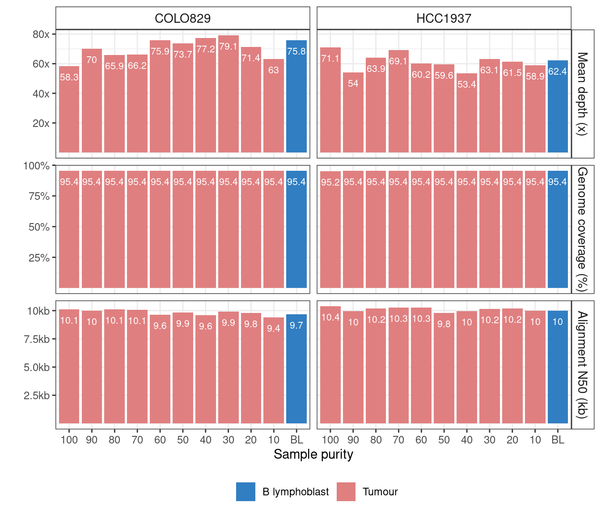
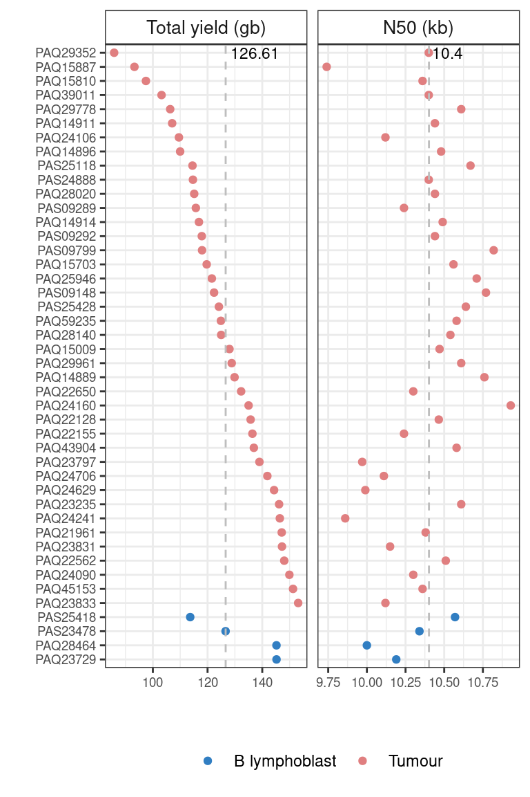
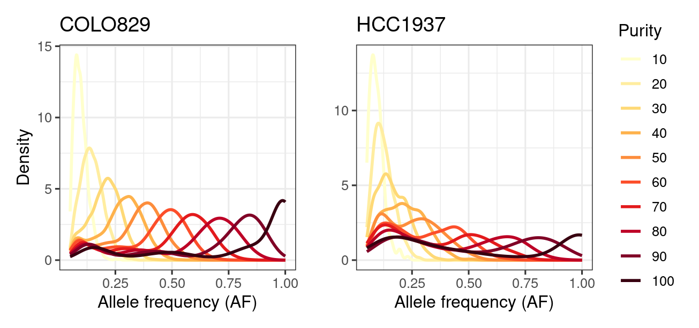

Check the purity of samples and QC of sequencing data
================

### Sequencing data quality

We sequenced mixed DNA libraries on Promethion, basecalled reads with
`dorado`, and aligned them with `minimap2`. The average mapping depth
and genomic coverage were computed with `mosdepth` and `bamcov`. The N50
was calcualted with in-house python script
[getAlignmentN50.py](scripts/getAlignmentN50.py) using pysam.

``` bash
mosdepth -n -t 10 $prefix $input
bamcov -H $input $output
python scripts/getAlignmentN50.py $input > $output
```



\##Check per flowcell yield for this project



### Check tumor purity

We used the VAF of all SNPs at CN=2 regions to estimate the purity
gradient. The copy-number segments were obtained from short-read data
using ascatNGS.

``` bash
awk -F"," '{if($7==2) {OFS="\t";print "chr"$2,$3,$4}}' colo829.copynumber.caveman.csv|grep -Ev "chrX|chrY" > colo829.cn2.tsv
awk -F"," '{if($7==2) {OFS="\t";print "chr"$2,$3,$4}}' hcc1937.copynumber.caveman.csv|grep -Ev "chrX|chrY" > hcc1937.cn2.tsv

for i in COLO829*.vcf.gz;do 
    sample=`basename $i .vcf.gz`
    bcftools view -R colo829.cn2.tsv $i > cn2/$sample.vcf
done 

for i in HCC1937*.vcf.gz;do 
    sample=`basename $i .vcf.gz`
    bcftools view -R hcc1937.cn2.tsv $i > cn2/$sample.vcf
done 
```


