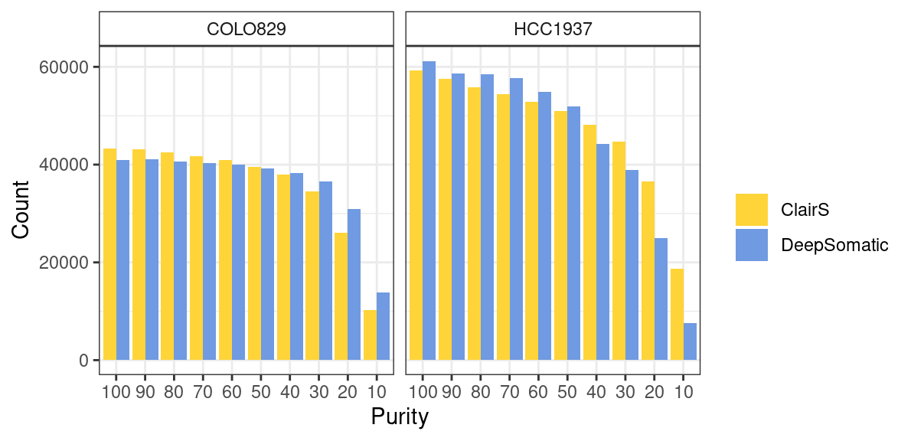
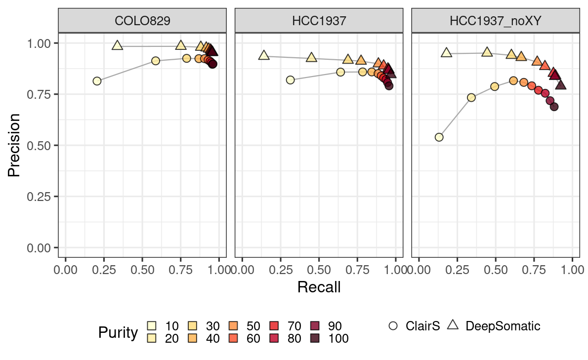
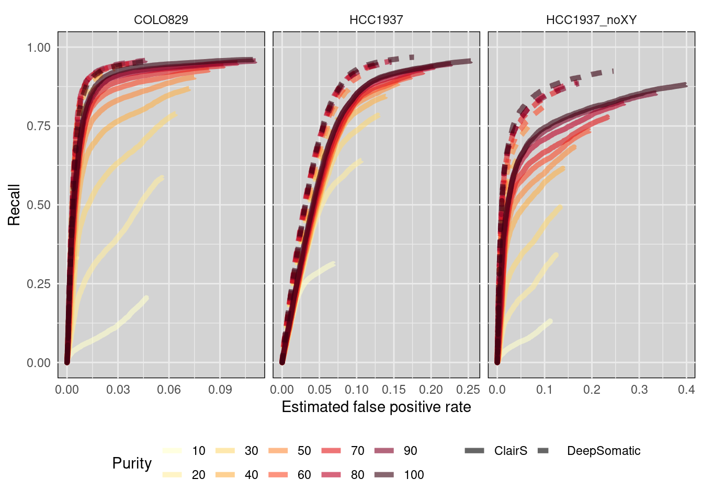
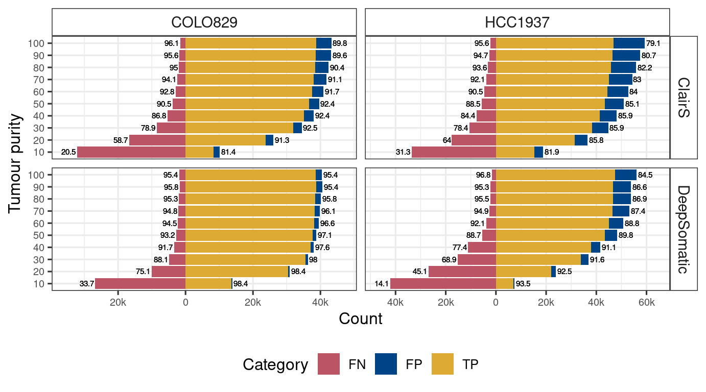
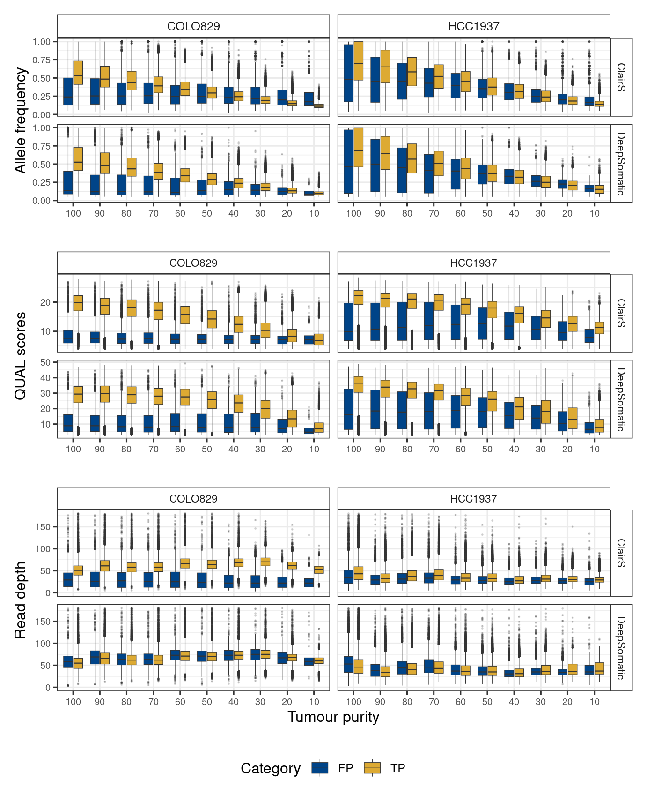
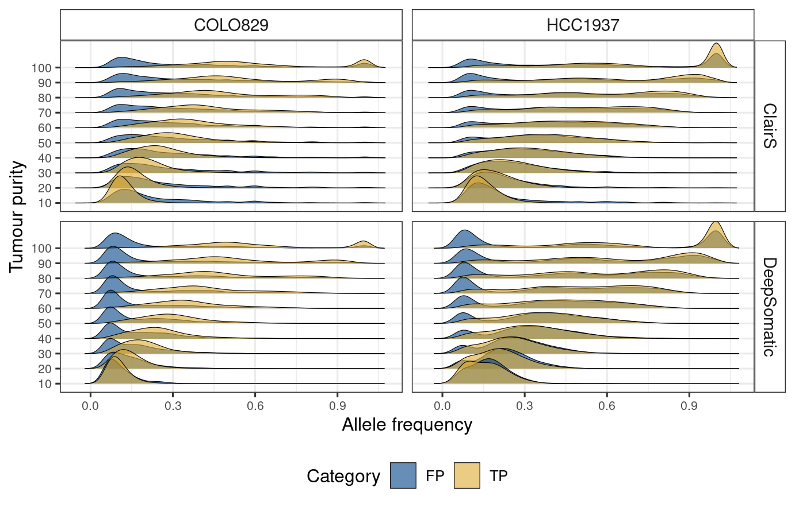
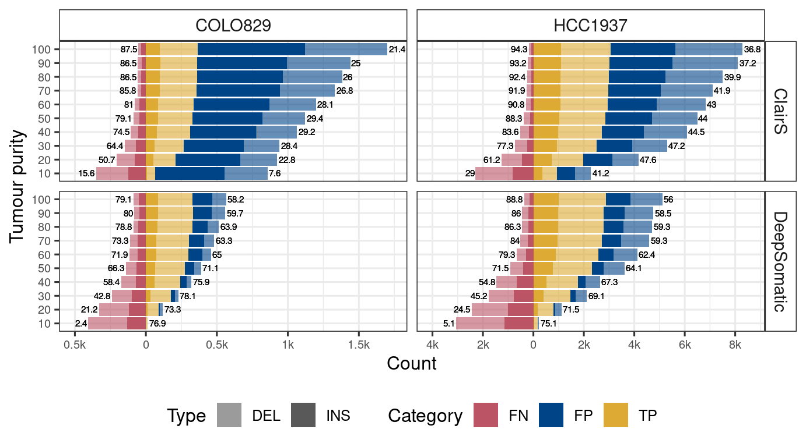
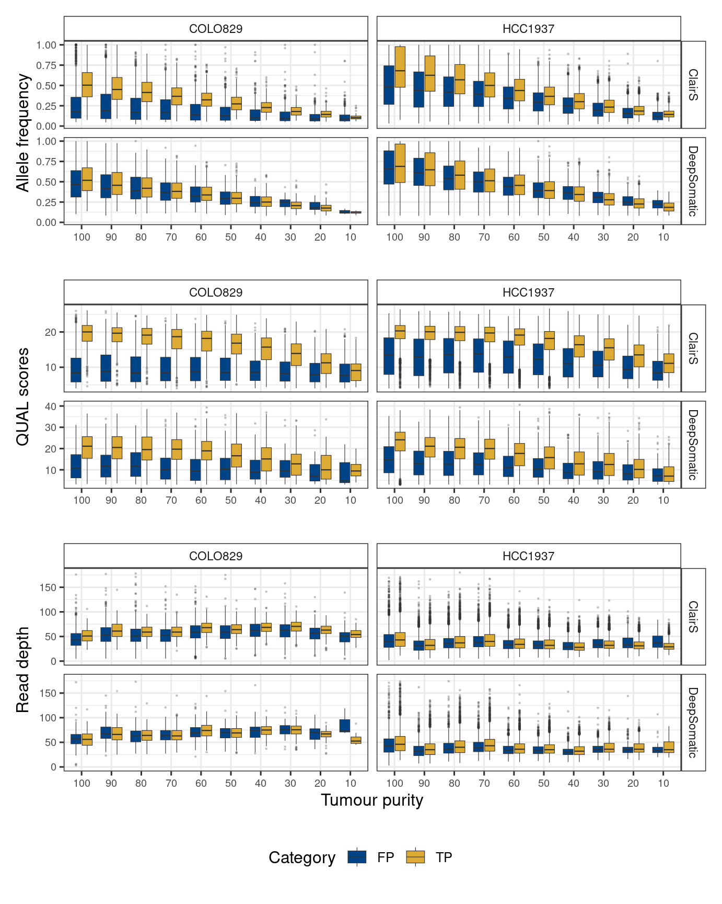

SNV and short indel calling performance in samples with different purity
================

We used `ClairS` and `DeepSomatic` to call somatic SNVs and indels in
samples with different tumour purity levels. We used Clair3 model
`r1041_e82_400bps_sup_v430` and ClairS `ont_r10_dorado_sup_5khz` for
ClairS SNV/indel calling, and we used `ONT_R104` for DeepSomatic
calling.

``` bash
singularity exec $ClairS_sif /opt/bin/run_clairs \
            --tumor_bam_fn $tumor_bam \
            --normal_bam_fn $normal_bam \
            --ref_fn $genome \
            --clair3_model_path $clair3_model \
            --include_all_ctgs --enable_indel_calling \
            --sample_name $tumor \
            --threads 24 \
            --platform ont_r10_dorado_sup_5khz \
            --output_dir $outdir \
            --remove_intermediate_dir \
            --conda_prefix /opt/conda/envs/clairs
            

singularity exec $deepsomatic_sif /opt/deepvariant/bin/deepsomatic/run_deepsomatic \
        --ref=$genome \
        --model_type=ONT_R104 \
        --reads_normal=$normal_bam \
        --reads_tumor=$tumor_bam \
        --output_vcf=$output \
        --sample_name_tumor="$tumor" \
        --sample_name_normal="$normal" \
        --num_shards=24 \
        --logging_dir=$log \
        --customized_model=$ONT_model
```

### Number of somatic SNVs detected in samples



**Figure 1: The number of somatic SNV and indels identifed in COLO829
and HCC1937 samples with varying tumour purity levels using ClairS and
DeepSomatic**

### SNV calling performance in samples with different tumour purity levels

We used the `compare_vcf` module within ClairS to Compare these
SNV/indels against our short-read “gold standard”.

``` bash
singularity exec {ClairS_sif} python /opt/bin/clairs.py compare_vcf \
        --truth_vcf_fn {params.gs} \
        --input_vcf_fn {input.snv} \
        --threads {threads} \
        --ref_fn {input.genome} \
        --output_dir {params.outdir} | grep -E 'SNV' >> {output}
```

| tool        | celltype     | purity | Precision | Recall | F1.score |    TP |    FP |    FN |
|:------------|:-------------|:-------|----------:|-------:|---------:|------:|------:|------:|
| clairS      | COLO829      | 10     |    0.8140 | 0.2049 |   0.3274 |  8284 |  1893 | 32138 |
| clairS      | COLO829      | 20     |    0.9129 | 0.5868 |   0.7144 | 23721 |  2263 | 16701 |
| clairS      | COLO829      | 30     |    0.9251 | 0.7888 |   0.8515 | 31884 |  2581 |  8538 |
| clairS      | COLO829      | 40     |    0.9237 | 0.8683 |   0.8952 | 35098 |  2898 |  5324 |
| clairS      | COLO829      | 50     |    0.9236 | 0.9049 |   0.9142 | 36579 |  3027 |  3843 |
| clairS      | COLO829      | 60     |    0.9174 | 0.9278 |   0.9226 | 37505 |  3375 |  2917 |
| clairS      | COLO829      | 70     |    0.9109 | 0.9408 |   0.9256 | 38028 |  3722 |  2394 |
| clairS      | COLO829      | 80     |    0.9045 | 0.9499 |   0.9267 | 38397 |  4052 |  2025 |
| clairS      | COLO829      | 90     |    0.8960 | 0.9562 |   0.9251 | 38652 |  4487 |  1770 |
| clairS      | COLO829      | 100    |    0.8978 | 0.9605 |   0.9281 | 38826 |  4421 |  1596 |
| clairS      | HCC1937_noXY | 10     |    0.5395 | 0.1313 |   0.2113 |  2124 |  1813 | 14047 |
| clairS      | HCC1937      | 10     |    0.8193 | 0.3132 |   0.4532 | 15341 |  3384 | 33636 |
| clairS      | HCC1937_noXY | 20     |    0.7333 | 0.3412 |   0.4657 |  5517 |  2007 | 10654 |
| clairS      | HCC1937      | 20     |    0.8578 | 0.6404 |   0.7333 | 31364 |  5199 | 17613 |
| clairS      | HCC1937_noXY | 30     |    0.7872 | 0.4933 |   0.6065 |  7977 |  2156 |  8194 |
| clairS      | HCC1937      | 30     |    0.8587 | 0.7842 |   0.8197 | 38406 |  6320 | 10571 |
| clairS      | HCC1937_noXY | 40     |    0.8160 | 0.6157 |   0.7018 |  9956 |  2245 |  6215 |
| clairS      | HCC1937      | 40     |    0.8587 | 0.8436 |   0.8511 | 41318 |  6798 |  7659 |
| clairS      | HCC1937_noXY | 50     |    0.8077 | 0.6832 |   0.7402 | 11048 |  2631 |  5123 |
| clairS      | HCC1937      | 50     |    0.8505 | 0.8847 |   0.8672 | 43329 |  7619 |  5648 |
| clairS      | HCC1937_noXY | 60     |    0.7909 | 0.7347 |   0.7618 | 11881 |  3141 |  4290 |
| clairS      | HCC1937      | 60     |    0.8398 | 0.9050 |   0.8712 | 44322 |  8453 |  4655 |
| clairS      | HCC1937_noXY | 70     |    0.7693 | 0.7785 |   0.7739 | 12589 |  3776 |  3582 |
| clairS      | HCC1937      | 70     |    0.8296 | 0.9209 |   0.8729 | 45103 |  9263 |  3874 |
| clairS      | HCC1937_noXY | 80     |    0.7544 | 0.8225 |   0.7870 | 13301 |  4331 |  2870 |
| clairS      | HCC1937      | 80     |    0.8217 | 0.9361 |   0.8752 | 45846 |  9949 |  3131 |
| clairS      | HCC1937_noXY | 90     |    0.7181 | 0.8543 |   0.7803 | 13815 |  5422 |  2356 |
| clairS      | HCC1937      | 90     |    0.8068 | 0.9467 |   0.8712 | 46367 | 11104 |  2610 |
| clairS      | HCC1937_noXY | 100    |    0.6884 | 0.8810 |   0.7729 | 14246 |  6448 |  1925 |
| clairS      | HCC1937      | 100    |    0.7906 | 0.9563 |   0.8656 | 46836 | 12402 |  2141 |
| deepsomatic | COLO829      | 10     |    0.9835 | 0.3372 |   0.5022 | 13629 |   229 | 26793 |
| deepsomatic | COLO829      | 20     |    0.9839 | 0.7512 |   0.8520 | 30367 |   497 | 10055 |
| deepsomatic | COLO829      | 30     |    0.9796 | 0.8810 |   0.9277 | 35610 |   740 |  4812 |
| deepsomatic | COLO829      | 40     |    0.9761 | 0.9166 |   0.9454 | 37049 |   909 |  3373 |
| deepsomatic | COLO829      | 50     |    0.9707 | 0.9323 |   0.9511 | 37686 |  1138 |  2736 |
| deepsomatic | COLO829      | 60     |    0.9662 | 0.9448 |   0.9554 | 38191 |  1335 |  2231 |
| deepsomatic | COLO829      | 70     |    0.9612 | 0.9480 |   0.9546 | 38321 |  1546 |  2101 |
| deepsomatic | COLO829      | 80     |    0.9583 | 0.9525 |   0.9554 | 38501 |  1675 |  1921 |
| deepsomatic | COLO829      | 90     |    0.9542 | 0.9578 |   0.9560 | 38715 |  1860 |  1707 |
| deepsomatic | COLO829      | 100    |    0.9535 | 0.9542 |   0.9539 | 38572 |  1879 |  1850 |
| deepsomatic | HCC1937_noXY | 10     |    0.9480 | 0.1792 |   0.3014 |  2898 |   159 | 13273 |
| deepsomatic | HCC1937      | 10     |    0.9351 | 0.1410 |   0.2451 |  6906 |   479 | 42071 |
| deepsomatic | HCC1937_noXY | 20     |    0.9509 | 0.4439 |   0.6053 |  7179 |   371 |  8992 |
| deepsomatic | HCC1937      | 20     |    0.9246 | 0.4509 |   0.6062 | 22082 |  1800 | 26895 |
| deepsomatic | HCC1937_noXY | 30     |    0.9398 | 0.6023 |   0.7341 |  9740 |   624 |  6431 |
| deepsomatic | HCC1937      | 30     |    0.9157 | 0.6888 |   0.7862 | 33737 |  3105 | 15240 |
| deepsomatic | HCC1937_noXY | 40     |    0.9295 | 0.6665 |   0.7763 | 10778 |   818 |  5393 |
| deepsomatic | HCC1937      | 40     |    0.9114 | 0.7738 |   0.8369 | 37897 |  3686 | 11080 |
| deepsomatic | HCC1937_noXY | 50     |    0.9068 | 0.7704 |   0.8331 | 12458 |  1280 |  3713 |
| deepsomatic | HCC1937      | 50     |    0.8984 | 0.8869 |   0.8926 | 43440 |  4915 |  5537 |
| deepsomatic | HCC1937_noXY | 60     |    0.8854 | 0.8207 |   0.8518 | 13271 |  1718 |  2900 |
| deepsomatic | HCC1937      | 60     |    0.8884 | 0.9211 |   0.9045 | 45114 |  5669 |  3863 |
| deepsomatic | HCC1937_noXY | 70     |    0.8520 | 0.8759 |   0.8638 | 14164 |  2461 |  2007 |
| deepsomatic | HCC1937      | 70     |    0.8740 | 0.9489 |   0.9099 | 46473 |  6699 |  2504 |
| deepsomatic | HCC1937_noXY | 80     |    0.8400 | 0.8896 |   0.8640 | 14385 |  2741 |  1786 |
| deepsomatic | HCC1937      | 80     |    0.8692 | 0.9547 |   0.9099 | 46758 |  7038 |  2219 |
| deepsomatic | HCC1937_noXY | 90     |    0.8366 | 0.8849 |   0.8601 | 14310 |  2794 |  1861 |
| deepsomatic | HCC1937      | 90     |    0.8664 | 0.9532 |   0.9077 | 46686 |  7199 |  2291 |
| deepsomatic | HCC1937_noXY | 100    |    0.7899 | 0.9238 |   0.8516 | 14939 |  3973 |  1232 |
| deepsomatic | HCC1937      | 100    |    0.8454 | 0.9681 |   0.9026 | 47417 |  8670 |  1560 |



    Warning: Removed 3 rows containing missing values (`geom_line()`).



    Warning: Removed 3 rows containing missing values (`geom_line()`).

**Figure 2: A ROC-like plot for SNV performance under varying tumour
purity levels in COLO829 and HCC1937 using ClairS and DeepSomatic**



**Figure 3: SNV calling recall and precision under varying tumour purity
levels in COLO829 and HCC1937 using ClairS and DeepSomatic**

**What is the difference in distribution of VAF, read depth and QUAL
scores between TP and FP?**

    Warning: Removed 1671 rows containing non-finite values (`stat_boxplot()`).
    Removed 1671 rows containing non-finite values (`stat_boxplot()`).



**Figure 4: VAF, DP and QUAL score distribution of SNV true positive and
false positive calls in COLO829 and HCC1937**



**Figure 5: VAF distribution in ridgeline plot of SNV true positive and
false positive calls in COLO829 and HCC1937**

### Indel calling performance in samples with different tumour purity levels

We also used `compare_vcf` module of `clairS` to benchmark indel calling
with our pre-built gold standard indels.

| tool        | celltype | purity | Type  | Precision | Recall | F1.score |   TP |   FP |   FN |
|:------------|:---------|:-------|:------|----------:|-------:|---------:|-----:|-----:|-----:|
| clairS      | COLO829  | 10     | INDEL |    0.0758 | 0.1562 |   0.1021 |   65 |  792 |  351 |
| clairS      | COLO829  | 10     | INS   |    0.0181 | 0.0682 |   0.0286 |    9 |  489 |  123 |
| clairS      | COLO829  | 10     | DEL   |    0.1560 | 0.1972 |   0.1742 |   56 |  303 |  228 |
| clairS      | COLO829  | 20     | INDEL |    0.2281 | 0.5072 |   0.3147 |  211 |  714 |  205 |
| clairS      | COLO829  | 20     | INS   |    0.1032 | 0.3939 |   0.1635 |   52 |  452 |   80 |
| clairS      | COLO829  | 20     | DEL   |    0.3777 | 0.5599 |   0.4511 |  159 |  262 |  125 |
| clairS      | COLO829  | 30     | INDEL |    0.2845 | 0.6442 |   0.3947 |  268 |  674 |  148 |
| clairS      | COLO829  | 30     | INS   |    0.1286 | 0.4697 |   0.2020 |   62 |  420 |   70 |
| clairS      | COLO829  | 30     | DEL   |    0.4478 | 0.7254 |   0.5538 |  206 |  254 |   78 |
| clairS      | COLO829  | 40     | INDEL |    0.2916 | 0.7452 |   0.4192 |  310 |  753 |  106 |
| clairS      | COLO829  | 40     | INS   |    0.1434 | 0.5985 |   0.2313 |   79 |  472 |   53 |
| clairS      | COLO829  | 40     | DEL   |    0.4512 | 0.8134 |   0.5804 |  231 |  281 |   53 |
| clairS      | COLO829  | 50     | INDEL |    0.2935 | 0.7909 |   0.4281 |  329 |  792 |   87 |
| clairS      | COLO829  | 50     | INS   |    0.1473 | 0.6439 |   0.2398 |   85 |  492 |   47 |
| clairS      | COLO829  | 50     | DEL   |    0.4485 | 0.8592 |   0.5894 |  244 |  300 |   40 |
| clairS      | COLO829  | 60     | INDEL |    0.2815 | 0.8101 |   0.4179 |  337 |  860 |   79 |
| clairS      | COLO829  | 60     | INS   |    0.1387 | 0.6515 |   0.2287 |   86 |  534 |   46 |
| clairS      | COLO829  | 60     | DEL   |    0.4350 | 0.8838 |   0.5830 |  251 |  326 |   33 |
| clairS      | COLO829  | 70     | INDEL |    0.2682 | 0.8582 |   0.4087 |  357 |  974 |   59 |
| clairS      | COLO829  | 70     | INS   |    0.1414 | 0.7348 |   0.2372 |   97 |  589 |   35 |
| clairS      | COLO829  | 70     | DEL   |    0.4031 | 0.9155 |   0.5597 |  260 |  385 |   24 |
| clairS      | COLO829  | 80     | INDEL |    0.2603 | 0.8654 |   0.4002 |  360 | 1023 |   56 |
| clairS      | COLO829  | 80     | INS   |    0.1406 | 0.7500 |   0.2368 |   99 |  605 |   33 |
| clairS      | COLO829  | 80     | DEL   |    0.3844 | 0.9190 |   0.5421 |  261 |  418 |   23 |
| clairS      | COLO829  | 90     | INDEL |    0.2500 | 0.8654 |   0.3879 |  360 | 1080 |   56 |
| clairS      | COLO829  | 90     | INS   |    0.1378 | 0.7652 |   0.2335 |  101 |  632 |   31 |
| clairS      | COLO829  | 90     | DEL   |    0.3663 | 0.9120 |   0.5227 |  259 |  448 |   25 |
| clairS      | COLO829  | 100    | INDEL |    0.2140 | 0.8750 |   0.3439 |  364 | 1337 |   52 |
| clairS      | COLO829  | 100    | INS   |    0.1158 | 0.7500 |   0.2006 |   99 |  756 |   33 |
| clairS      | COLO829  | 100    | DEL   |    0.3132 | 0.9331 |   0.4690 |  265 |  581 |   19 |
| clairS      | HCC1937  | 10     | INDEL |    0.4123 | 0.2899 |   0.3404 |  938 | 1337 | 2298 |
| clairS      | HCC1937  | 10     | INS   |    0.3305 | 0.3034 |   0.3164 |  355 |  719 |  815 |
| clairS      | HCC1937  | 10     | DEL   |    0.4854 | 0.2822 |   0.3569 |  583 |  618 | 1483 |
| clairS      | HCC1937  | 20     | INDEL |    0.4757 | 0.6119 |   0.5353 | 1980 | 2182 | 1256 |
| clairS      | HCC1937  | 20     | INS   |    0.3863 | 0.6214 |   0.4764 |  727 | 1155 |  443 |
| clairS      | HCC1937  | 20     | DEL   |    0.5496 | 0.6065 |   0.5766 | 1253 | 1027 |  813 |
| clairS      | HCC1937  | 30     | INDEL |    0.4720 | 0.7726 |   0.5860 | 2500 | 2797 |  736 |
| clairS      | HCC1937  | 30     | INS   |    0.3977 | 0.7991 |   0.5311 |  935 | 1416 |  235 |
| clairS      | HCC1937  | 30     | DEL   |    0.5312 | 0.7575 |   0.6245 | 1565 | 1381 |  501 |
| clairS      | HCC1937  | 40     | INDEL |    0.4451 | 0.8362 |   0.5809 | 2706 | 3374 |  530 |
| clairS      | HCC1937  | 40     | INS   |    0.3687 | 0.8410 |   0.5126 |  984 | 1685 |  186 |
| clairS      | HCC1937  | 40     | DEL   |    0.5048 | 0.8335 |   0.6288 | 1722 | 1689 |  344 |
| clairS      | HCC1937  | 50     | INDEL |    0.4395 | 0.8832 |   0.5869 | 2858 | 3645 |  378 |
| clairS      | HCC1937  | 50     | INS   |    0.3608 | 0.8872 |   0.5130 | 1038 | 1839 |  132 |
| clairS      | HCC1937  | 50     | DEL   |    0.5019 | 0.8809 |   0.6395 | 1820 | 1806 |  246 |
| clairS      | HCC1937  | 60     | INDEL |    0.4296 | 0.9082 |   0.5833 | 2939 | 3902 |  297 |
| clairS      | HCC1937  | 60     | INS   |    0.3527 | 0.9120 |   0.5087 | 1067 | 1958 |  103 |
| clairS      | HCC1937  | 60     | DEL   |    0.4906 | 0.9061 |   0.6365 | 1872 | 1944 |  194 |
| clairS      | HCC1937  | 70     | INDEL |    0.4192 | 0.9193 |   0.5758 | 2975 | 4122 |  261 |
| clairS      | HCC1937  | 70     | INS   |    0.3426 | 0.9222 |   0.4997 | 1079 | 2070 |   91 |
| clairS      | HCC1937  | 70     | DEL   |    0.4802 | 0.9177 |   0.6305 | 1896 | 2052 |  170 |
| clairS      | HCC1937  | 80     | INDEL |    0.3991 | 0.9243 |   0.5575 | 2991 | 4504 |  245 |
| clairS      | HCC1937  | 80     | INS   |    0.3246 | 0.9231 |   0.4803 | 1080 | 2247 |   90 |
| clairS      | HCC1937  | 80     | DEL   |    0.4585 | 0.9250 |   0.6131 | 1911 | 2257 |  155 |
| clairS      | HCC1937  | 90     | INDEL |    0.3725 | 0.9323 |   0.5323 | 3017 | 5083 |  219 |
| clairS      | HCC1937  | 90     | INS   |    0.3038 | 0.9282 |   0.4577 | 1086 | 2489 |   84 |
| clairS      | HCC1937  | 90     | DEL   |    0.4267 | 0.9347 |   0.5860 | 1931 | 2594 |  135 |
| clairS      | HCC1937  | 100    | INDEL |    0.3682 | 0.9431 |   0.5297 | 3052 | 5236 |  184 |
| clairS      | HCC1937  | 100    | INS   |    0.2975 | 0.9342 |   0.4513 | 1093 | 2581 |   77 |
| clairS      | HCC1937  | 100    | DEL   |    0.4246 | 0.9482 |   0.5865 | 1959 | 2655 |  107 |
| deepsomatic | COLO829  | 10     | INDEL |    0.7692 | 0.0240 |   0.0466 |   10 |    3 |  406 |
| deepsomatic | COLO829  | 10     | INS   |    0.0000 | 0.0000 |   0.0000 |    0 |    0 |  132 |
| deepsomatic | COLO829  | 10     | DEL   |    0.7692 | 0.0352 |   0.0673 |   10 |    3 |  274 |
| deepsomatic | COLO829  | 20     | INDEL |    0.7333 | 0.2115 |   0.3284 |   88 |   32 |  328 |
| deepsomatic | COLO829  | 20     | INS   |    0.5417 | 0.0985 |   0.1667 |   13 |   11 |  119 |
| deepsomatic | COLO829  | 20     | DEL   |    0.7812 | 0.2641 |   0.3947 |   75 |   21 |  209 |
| deepsomatic | COLO829  | 30     | INDEL |    0.7807 | 0.4279 |   0.5528 |  178 |   50 |  238 |
| deepsomatic | COLO829  | 30     | INS   |    0.5593 | 0.2500 |   0.3455 |   33 |   26 |   99 |
| deepsomatic | COLO829  | 30     | DEL   |    0.8580 | 0.5106 |   0.6402 |  145 |   24 |  139 |
| deepsomatic | COLO829  | 40     | INDEL |    0.7594 | 0.5841 |   0.6603 |  243 |   77 |  173 |
| deepsomatic | COLO829  | 40     | INS   |    0.5769 | 0.4545 |   0.5085 |   60 |   44 |   72 |
| deepsomatic | COLO829  | 40     | DEL   |    0.8472 | 0.6444 |   0.7320 |  183 |   33 |  101 |
| deepsomatic | COLO829  | 50     | INDEL |    0.7113 | 0.6635 |   0.6866 |  276 |  112 |  140 |
| deepsomatic | COLO829  | 50     | INS   |    0.5039 | 0.4924 |   0.4981 |   65 |   64 |   67 |
| deepsomatic | COLO829  | 50     | DEL   |    0.8147 | 0.7430 |   0.7772 |  211 |   48 |   73 |
| deepsomatic | COLO829  | 60     | INDEL |    0.6500 | 0.7188 |   0.6826 |  299 |  161 |  117 |
| deepsomatic | COLO829  | 60     | INS   |    0.4327 | 0.5606 |   0.4884 |   74 |   97 |   58 |
| deepsomatic | COLO829  | 60     | DEL   |    0.7785 | 0.7923 |   0.7853 |  225 |   64 |   59 |
| deepsomatic | COLO829  | 70     | INDEL |    0.6328 | 0.7332 |   0.6793 |  305 |  177 |  111 |
| deepsomatic | COLO829  | 70     | INS   |    0.4068 | 0.5455 |   0.4660 |   72 |  105 |   60 |
| deepsomatic | COLO829  | 70     | DEL   |    0.7639 | 0.8204 |   0.7912 |  233 |   72 |   51 |
| deepsomatic | COLO829  | 80     | INDEL |    0.6394 | 0.7885 |   0.7061 |  328 |  185 |   88 |
| deepsomatic | COLO829  | 80     | INS   |    0.4324 | 0.6061 |   0.5047 |   80 |  105 |   52 |
| deepsomatic | COLO829  | 80     | DEL   |    0.7561 | 0.8732 |   0.8105 |  248 |   80 |   36 |
| deepsomatic | COLO829  | 90     | INDEL |    0.5968 | 0.8005 |   0.6838 |  333 |  225 |   83 |
| deepsomatic | COLO829  | 90     | INS   |    0.3917 | 0.6439 |   0.4871 |   85 |  132 |   47 |
| deepsomatic | COLO829  | 90     | DEL   |    0.7273 | 0.8732 |   0.7936 |  248 |   93 |   36 |
| deepsomatic | COLO829  | 100    | INDEL |    0.5823 | 0.7909 |   0.6707 |  329 |  236 |   87 |
| deepsomatic | COLO829  | 100    | INS   |    0.3750 | 0.6364 |   0.4719 |   84 |  140 |   48 |
| deepsomatic | COLO829  | 100    | DEL   |    0.7185 | 0.8627 |   0.7840 |  245 |   96 |   39 |
| deepsomatic | HCC1937  | 10     | INDEL |    0.7511 | 0.0513 |   0.0960 |  166 |   55 | 3070 |
| deepsomatic | HCC1937  | 10     | INS   |    0.7500 | 0.0205 |   0.0399 |   24 |    8 | 1146 |
| deepsomatic | HCC1937  | 10     | DEL   |    0.7513 | 0.0687 |   0.1259 |  142 |   47 | 1924 |
| deepsomatic | HCC1937  | 20     | INDEL |    0.7153 | 0.2454 |   0.3654 |  794 |  316 | 2442 |
| deepsomatic | HCC1937  | 20     | INS   |    0.6805 | 0.1402 |   0.2325 |  164 |   77 | 1006 |
| deepsomatic | HCC1937  | 20     | DEL   |    0.7250 | 0.3049 |   0.4293 |  630 |  239 | 1436 |
| deepsomatic | HCC1937  | 30     | INDEL |    0.6905 | 0.4515 |   0.5460 | 1461 |  655 | 1775 |
| deepsomatic | HCC1937  | 30     | INS   |    0.6478 | 0.3427 |   0.4483 |  401 |  218 |  769 |
| deepsomatic | HCC1937  | 30     | DEL   |    0.7081 | 0.5131 |   0.5950 | 1060 |  437 | 1006 |
| deepsomatic | HCC1937  | 40     | INDEL |    0.6730 | 0.5482 |   0.6042 | 1774 |  862 | 1462 |
| deepsomatic | HCC1937  | 40     | INS   |    0.6397 | 0.4385 |   0.5203 |  513 |  289 |  657 |
| deepsomatic | HCC1937  | 40     | DEL   |    0.6876 | 0.6104 |   0.6467 | 1261 |  573 |  805 |
| deepsomatic | HCC1937  | 50     | INDEL |    0.6415 | 0.7151 |   0.6763 | 2314 | 1293 |  922 |
| deepsomatic | HCC1937  | 50     | INS   |    0.6223 | 0.6590 |   0.6401 |  771 |  468 |  399 |
| deepsomatic | HCC1937  | 50     | DEL   |    0.6516 | 0.7469 |   0.6960 | 1543 |  825 |  523 |
| deepsomatic | HCC1937  | 60     | INDEL |    0.6238 | 0.7933 |   0.6984 | 2567 | 1548 |  669 |
| deepsomatic | HCC1937  | 60     | INS   |    0.5935 | 0.7538 |   0.6642 |  882 |  604 |  288 |
| deepsomatic | HCC1937  | 60     | DEL   |    0.6409 | 0.8156 |   0.7178 | 1685 |  944 |  381 |
| deepsomatic | HCC1937  | 70     | INDEL |    0.5930 | 0.8396 |   0.6951 | 2717 | 1865 |  519 |
| deepsomatic | HCC1937  | 70     | INS   |    0.5556 | 0.8111 |   0.6595 |  949 |  759 |  221 |
| deepsomatic | HCC1937  | 70     | DEL   |    0.6152 | 0.8558 |   0.7158 | 1768 | 1106 |  298 |
| deepsomatic | HCC1937  | 80     | INDEL |    0.5927 | 0.8631 |   0.7028 | 2793 | 1919 |  443 |
| deepsomatic | HCC1937  | 80     | INS   |    0.5540 | 0.8368 |   0.6667 |  979 |  788 |  191 |
| deepsomatic | HCC1937  | 80     | DEL   |    0.6160 | 0.8780 |   0.7240 | 1814 | 1131 |  252 |
| deepsomatic | HCC1937  | 90     | INDEL |    0.5854 | 0.8603 |   0.6967 | 2784 | 1972 |  452 |
| deepsomatic | HCC1937  | 90     | INS   |    0.5409 | 0.8299 |   0.6550 |  971 |  824 |  199 |
| deepsomatic | HCC1937  | 90     | DEL   |    0.6123 | 0.8775 |   0.7213 | 1813 | 1148 |  253 |
| deepsomatic | HCC1937  | 100    | INDEL |    0.5605 | 0.8884 |   0.6874 | 2875 | 2254 |  361 |
| deepsomatic | HCC1937  | 100    | INS   |    0.5121 | 0.8650 |   0.6434 | 1012 |  964 |  158 |
| deepsomatic | HCC1937  | 100    | DEL   |    0.5909 | 0.9017 |   0.7139 | 1863 | 1290 |  203 |



**Figure 6: Indel calling recall and precision under varying tumour
purity levels in COLO829 and HCC1937 using ClairS and DeepSomatic**

**We also check the VAF, DP and QUAL score distribution between true
positive and false positive calls**



**Figure 7: VAF, DP and QUAL score distribution of indel true positive
and false positive calls in COLO829 and HCC1937**
