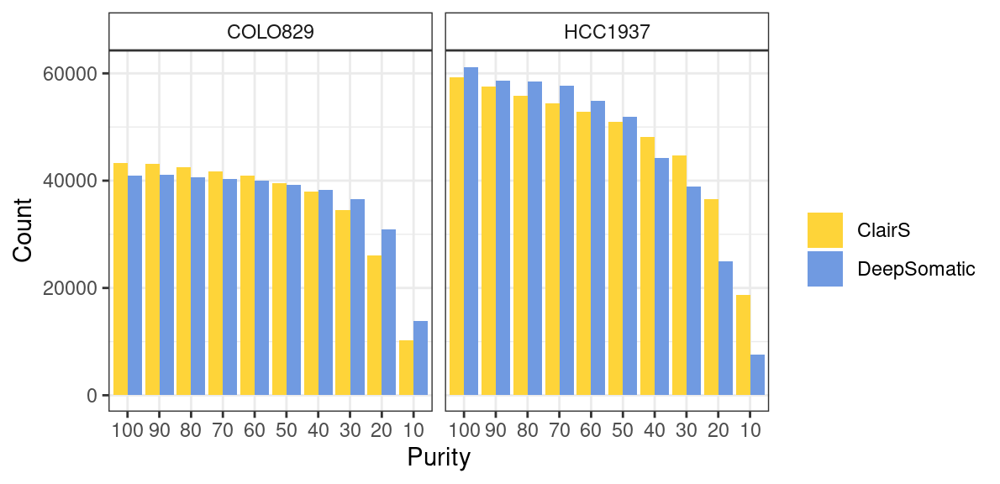
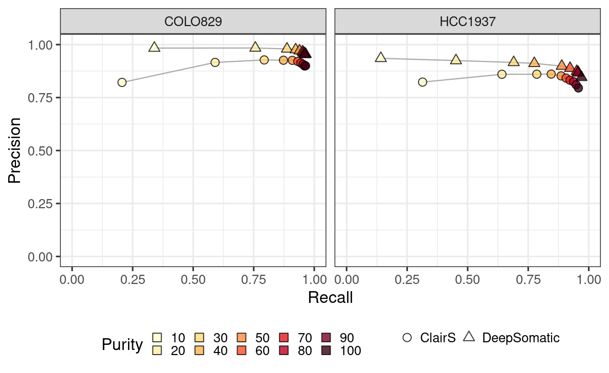
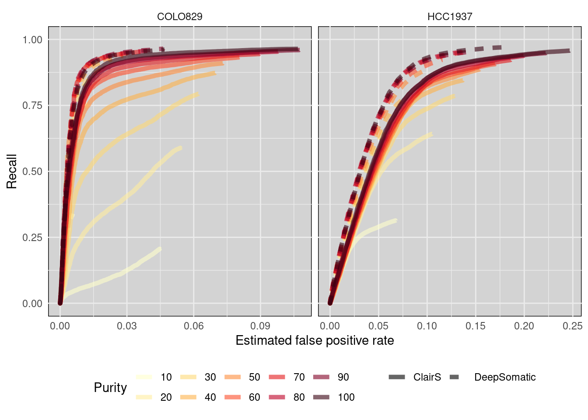
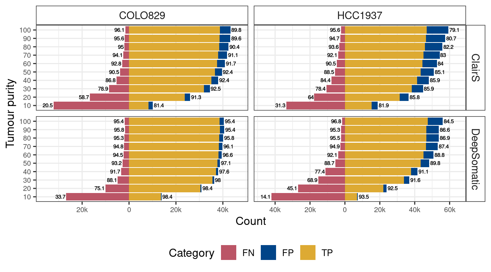
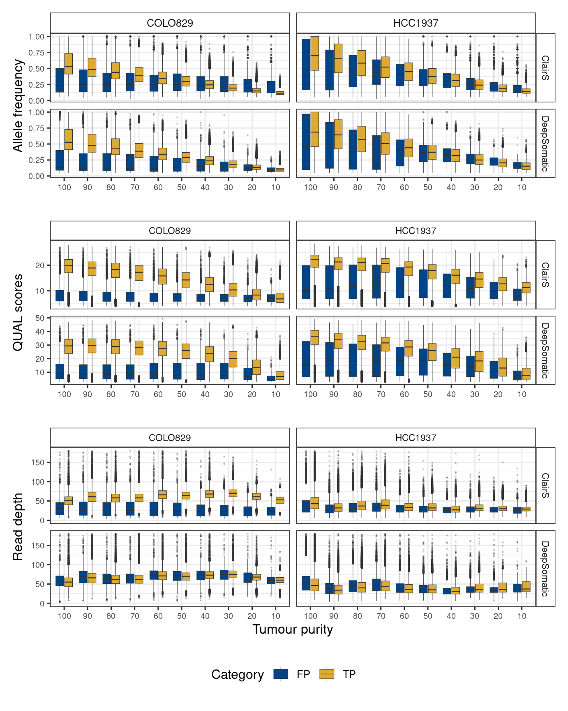
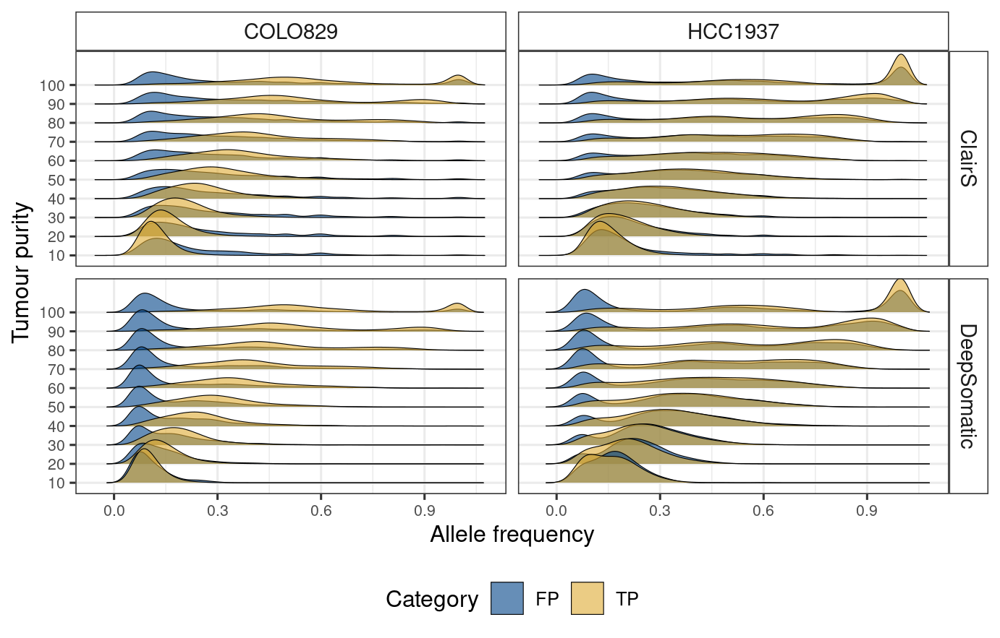
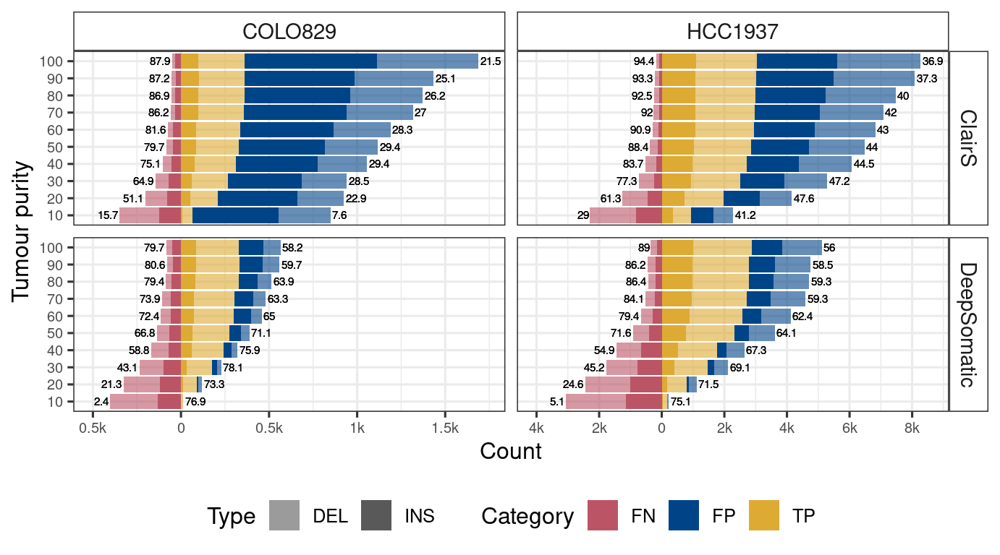

SNV and short indel calling performance in samples with different purity
================

We used `ClairS` and `DeepSomatic` to call somatic SNVs and indels in
samples with different tumour purity levels. We used Clair3 model
`r1041_e82_400bps_sup_v430` and ClairS `ont_r10_dorado_sup_5khz` for
ClairS SNV/indel calling, and we used `ONT_R104` for DeepSomatic
calling.

``` bash
singularity exec $ClairS_sif /opt/bin/run_clairs \
            --tumor_bam_fn $tumor_bam \
            --normal_bam_fn $normal_bam \
            --ref_fn $genome \
            --clair3_model_path $clair3_model \
            --include_all_ctgs --enable_indel_calling \
            --sample_name $tumor \
            --threads 24 \
            --platform ont_r10_dorado_sup_5khz \
            --output_dir $outdir \
            --remove_intermediate_dir \
            --conda_prefix /opt/conda/envs/clairs
            

singularity exec $deepsomatic_sif /opt/deepvariant/bin/deepsomatic/run_deepsomatic \
        --ref=$genome \
        --model_type=ONT_R104 \
        --reads_normal=$normal_bam \
        --reads_tumor=$tumor_bam \
        --output_vcf=$output \
        --sample_name_tumor="$tumor" \
        --sample_name_normal="$normal" \
        --num_shards=24 \
        --logging_dir=$log \
        --customized_model=$ONT_model
```

### Number of somatic SNVs detected in samples



**Figure 1: The number of somatic SNV and indels identifed in COLO829
and HCC1937 samples with varying tumour purity levels using ClairS and
DeepSomatic**

### SNV calling performance in samples with different tumour purity levels

We used the `compare_vcf` module within ClairS to Compare these
SNV/indels against our short-read “gold standard”.

``` bash
singularity exec {ClairS_sif} python /opt/bin/clairs.py compare_vcf \
        --truth_vcf_fn {params.gs} \
        --input_vcf_fn {input.snv} \
        --threads {threads} \
        --ref_fn {input.genome} \
        --output_dir {params.outdir} | grep -E 'SNV' >> {output}
```

| tool        | celltype | purity | Precision | Recall | F1.score |    TP |    FP |    FN |
|:------------|:---------|:-------|----------:|-------:|---------:|------:|------:|------:|
| clairS      | COLO829  | 10     |    0.8215 | 0.2062 |   0.3297 |  8275 |  1798 | 31852 |
| clairS      | COLO829  | 20     |    0.9159 | 0.5905 |   0.7180 | 23694 |  2175 | 16433 |
| clairS      | COLO829  | 30     |    0.9276 | 0.7934 |   0.8552 | 31835 |  2485 |  8292 |
| clairS      | COLO829  | 40     |    0.9262 | 0.8729 |   0.8988 | 35028 |  2793 |  5099 |
| clairS      | COLO829  | 50     |    0.9257 | 0.9095 |   0.9175 | 36494 |  2928 |  3633 |
| clairS      | COLO829  | 60     |    0.9205 | 0.9321 |   0.9263 | 37403 |  3229 |  2724 |
| clairS      | COLO829  | 70     |    0.9134 | 0.9447 |   0.9288 | 37909 |  3593 |  2218 |
| clairS      | COLO829  | 80     |    0.9070 | 0.9538 |   0.9299 | 38275 |  3923 |  1852 |
| clairS      | COLO829  | 90     |    0.8992 | 0.9599 |   0.9286 | 38518 |  4318 |  1609 |
| clairS      | COLO829  | 100    |    0.9003 | 0.9642 |   0.9311 | 38691 |  4287 |  1436 |
| clairS      | HCC1937  | 10     |    0.8230 | 0.3138 |   0.4543 | 15340 |  3300 | 33546 |
| clairS      | HCC1937  | 20     |    0.8599 | 0.6415 |   0.7348 | 31359 |  5111 | 17527 |
| clairS      | HCC1937  | 30     |    0.8603 | 0.7855 |   0.8212 | 38401 |  6238 | 10485 |
| clairS      | HCC1937  | 40     |    0.8608 | 0.8450 |   0.8528 | 41307 |  6678 |  7579 |
| clairS      | HCC1937  | 50     |    0.8523 | 0.8860 |   0.8688 | 43314 |  7508 |  5572 |
| clairS      | HCC1937  | 60     |    0.8422 | 0.9063 |   0.8731 | 44305 |  8300 |  4581 |
| clairS      | HCC1937  | 70     |    0.8322 | 0.9222 |   0.8749 | 45085 |  9093 |  3801 |
| clairS      | HCC1937  | 80     |    0.8248 | 0.9374 |   0.8775 | 45825 |  9734 |  3061 |
| clairS      | HCC1937  | 90     |    0.8103 | 0.9481 |   0.8738 | 46347 | 10853 |  2539 |
| clairS      | HCC1937  | 100    |    0.7951 | 0.9574 |   0.8687 | 46805 | 12064 |  2081 |
| deepsomatic | COLO829  | 10     |    0.9835 | 0.3396 |   0.5049 | 13629 |   229 | 26498 |
| deepsomatic | COLO829  | 20     |    0.9839 | 0.7568 |   0.8555 | 30367 |   497 |  9760 |
| deepsomatic | COLO829  | 30     |    0.9796 | 0.8874 |   0.9313 | 35610 |   740 |  4517 |
| deepsomatic | COLO829  | 40     |    0.9761 | 0.9233 |   0.9489 | 37049 |   909 |  3078 |
| deepsomatic | COLO829  | 50     |    0.9707 | 0.9392 |   0.9547 | 37686 |  1138 |  2441 |
| deepsomatic | COLO829  | 60     |    0.9662 | 0.9518 |   0.9589 | 38191 |  1335 |  1936 |
| deepsomatic | COLO829  | 70     |    0.9612 | 0.9550 |   0.9581 | 38321 |  1546 |  1806 |
| deepsomatic | COLO829  | 80     |    0.9583 | 0.9595 |   0.9589 | 38501 |  1675 |  1626 |
| deepsomatic | COLO829  | 90     |    0.9542 | 0.9648 |   0.9595 | 38715 |  1860 |  1412 |
| deepsomatic | COLO829  | 100    |    0.9535 | 0.9612 |   0.9574 | 38572 |  1879 |  1555 |
| deepsomatic | HCC1937  | 10     |    0.9351 | 0.1413 |   0.2455 |  6906 |   479 | 41980 |
| deepsomatic | HCC1937  | 20     |    0.9246 | 0.4517 |   0.6069 | 22082 |  1800 | 26804 |
| deepsomatic | HCC1937  | 30     |    0.9157 | 0.6901 |   0.7871 | 33737 |  3105 | 15149 |
| deepsomatic | HCC1937  | 40     |    0.9114 | 0.7752 |   0.8378 | 37897 |  3686 | 10989 |
| deepsomatic | HCC1937  | 50     |    0.8984 | 0.8886 |   0.8935 | 43440 |  4915 |  5446 |
| deepsomatic | HCC1937  | 60     |    0.8884 | 0.9228 |   0.9053 | 45114 |  5669 |  3772 |
| deepsomatic | HCC1937  | 70     |    0.8740 | 0.9506 |   0.9107 | 46473 |  6699 |  2413 |
| deepsomatic | HCC1937  | 80     |    0.8692 | 0.9565 |   0.9107 | 46758 |  7038 |  2128 |
| deepsomatic | HCC1937  | 90     |    0.8664 | 0.9550 |   0.9085 | 46686 |  7199 |  2200 |
| deepsomatic | HCC1937  | 100    |    0.8454 | 0.9700 |   0.9034 | 47417 |  8670 |  1469 |


The ROC curves show performance of snv calling under difference qual
scores.



**Figure 2: A ROC-like plot for SNV performance under varying tumour
purity levels in COLO829 and HCC1937 using ClairS and DeepSomatic**

And we are wondering if the best QUAL threshold changed for samples with
different tumour purities. Apparently, ClairS need a higher QUAL
threshold than DeepSomatic.



**Figure 3: The QUAL thresholds which maximise the F1 score for samples
with different tumour purity**


**Figure 4: SNV calling recall and precision under varying tumour purity
levels in COLO829 and HCC1937 using ClairS and DeepSomatic**

**What is the difference in distribution of VAF, read depth and QUAL
scores between TP and FP?**

    Warning: Removed 1606 rows containing non-finite values (`stat_boxplot()`).
    Removed 1606 rows containing non-finite values (`stat_boxplot()`).



**Figure 5: VAF, DP and QUAL score distribution of SNV true positive and
false positive calls in COLO829 and HCC1937**



**Figure 6: VAF distribution in ridgeline plot of SNV true positive and
false positive calls in COLO829 and HCC1937**

### Indel calling performance in samples with different tumour purity levels

We also used `compare_vcf` module of `clairS` to benchmark indel calling
with our pre-built gold standard indels.

| tool        | celltype | purity | Type  | Precision | Recall | F1.score |   TP |   FP |   FN |
|:------------|:---------|:-------|:------|----------:|-------:|---------:|-----:|-----:|-----:|
| clairS      | COLO829  | 10     | INDEL |    0.0764 | 0.1574 |   0.1028 |   65 |  786 |  348 |
| clairS      | COLO829  | 10     | INS   |    0.0181 | 0.0682 |   0.0287 |    9 |  487 |  123 |
| clairS      | COLO829  | 10     | DEL   |    0.1577 | 0.1993 |   0.1761 |   56 |  299 |  225 |
| clairS      | COLO829  | 20     | INDEL |    0.2286 | 0.5109 |   0.3159 |  211 |  712 |  202 |
| clairS      | COLO829  | 20     | INS   |    0.1036 | 0.3939 |   0.1640 |   52 |  450 |   80 |
| clairS      | COLO829  | 20     | DEL   |    0.3777 | 0.5658 |   0.4530 |  159 |  262 |  122 |
| clairS      | COLO829  | 30     | INDEL |    0.2854 | 0.6489 |   0.3964 |  268 |  671 |  145 |
| clairS      | COLO829  | 30     | INS   |    0.1289 | 0.4697 |   0.2023 |   62 |  419 |   70 |
| clairS      | COLO829  | 30     | DEL   |    0.4498 | 0.7331 |   0.5575 |  206 |  252 |   75 |
| clairS      | COLO829  | 40     | INDEL |    0.2936 | 0.7506 |   0.4221 |  310 |  746 |  103 |
| clairS      | COLO829  | 40     | INS   |    0.1447 | 0.5985 |   0.2330 |   79 |  467 |   53 |
| clairS      | COLO829  | 40     | DEL   |    0.4529 | 0.8221 |   0.5841 |  231 |  279 |   50 |
| clairS      | COLO829  | 50     | INDEL |    0.2945 | 0.7966 |   0.4301 |  329 |  788 |   84 |
| clairS      | COLO829  | 50     | INS   |    0.1481 | 0.6439 |   0.2408 |   85 |  489 |   47 |
| clairS      | COLO829  | 50     | DEL   |    0.4494 | 0.8683 |   0.5922 |  244 |  299 |   37 |
| clairS      | COLO829  | 60     | INDEL |    0.2834 | 0.8160 |   0.4207 |  337 |  852 |   76 |
| clairS      | COLO829  | 60     | INS   |    0.1396 | 0.6515 |   0.2299 |   86 |  530 |   46 |
| clairS      | COLO829  | 60     | DEL   |    0.4380 | 0.8932 |   0.5878 |  251 |  322 |   30 |
| clairS      | COLO829  | 70     | INDEL |    0.2697 | 0.8620 |   0.4108 |  356 |  964 |   57 |
| clairS      | COLO829  | 70     | INS   |    0.1426 | 0.7348 |   0.2389 |   97 |  583 |   35 |
| clairS      | COLO829  | 70     | DEL   |    0.4047 | 0.9217 |   0.5624 |  259 |  381 |   22 |
| clairS      | COLO829  | 80     | INDEL |    0.2619 | 0.8692 |   0.4025 |  359 | 1012 |   54 |
| clairS      | COLO829  | 80     | INS   |    0.1414 | 0.7500 |   0.2380 |   99 |  601 |   33 |
| clairS      | COLO829  | 80     | DEL   |    0.3875 | 0.9253 |   0.5462 |  260 |  411 |   21 |
| clairS      | COLO829  | 90     | INDEL |    0.2512 | 0.8717 |   0.3900 |  360 | 1073 |   53 |
| clairS      | COLO829  | 90     | INS   |    0.1387 | 0.7652 |   0.2349 |  101 |  627 |   31 |
| clairS      | COLO829  | 90     | DEL   |    0.3674 | 0.9217 |   0.5254 |  259 |  446 |   22 |
| clairS      | COLO829  | 100    | INDEL |    0.2150 | 0.8789 |   0.3455 |  363 | 1325 |   50 |
| clairS      | COLO829  | 100    | INS   |    0.1166 | 0.7500 |   0.2018 |   99 |  750 |   33 |
| clairS      | COLO829  | 100    | DEL   |    0.3147 | 0.9395 |   0.4714 |  264 |  575 |   17 |
| clairS      | HCC1937  | 10     | INDEL |    0.4125 | 0.2903 |   0.3408 |  938 | 1336 | 2293 |
| clairS      | HCC1937  | 10     | INS   |    0.3305 | 0.3037 |   0.3165 |  355 |  719 |  814 |
| clairS      | HCC1937  | 10     | DEL   |    0.4858 | 0.2827 |   0.3574 |  583 |  617 | 1479 |
| clairS      | HCC1937  | 20     | INDEL |    0.4764 | 0.6128 |   0.5361 | 1980 | 2176 | 1251 |
| clairS      | HCC1937  | 20     | INS   |    0.3869 | 0.6219 |   0.4770 |  727 | 1152 |  442 |
| clairS      | HCC1937  | 20     | DEL   |    0.5503 | 0.6077 |   0.5776 | 1253 | 1024 |  809 |
| clairS      | HCC1937  | 30     | INDEL |    0.4725 | 0.7731 |   0.5865 | 2498 | 2789 |  733 |
| clairS      | HCC1937  | 30     | INS   |    0.3978 | 0.7990 |   0.5311 |  934 | 1414 |  235 |
| clairS      | HCC1937  | 30     | DEL   |    0.5322 | 0.7585 |   0.6255 | 1564 | 1375 |  498 |
| clairS      | HCC1937  | 40     | INDEL |    0.4453 | 0.8369 |   0.5813 | 2704 | 3368 |  527 |
| clairS      | HCC1937  | 40     | INS   |    0.3687 | 0.8409 |   0.5126 |  983 | 1683 |  186 |
| clairS      | HCC1937  | 40     | DEL   |    0.5053 | 0.8346 |   0.6295 | 1721 | 1685 |  341 |
| clairS      | HCC1937  | 50     | INDEL |    0.4400 | 0.8839 |   0.5875 | 2856 | 3635 |  375 |
| clairS      | HCC1937  | 50     | INS   |    0.3609 | 0.8871 |   0.5131 | 1037 | 1836 |  132 |
| clairS      | HCC1937  | 50     | DEL   |    0.5028 | 0.8822 |   0.6405 | 1819 | 1799 |  243 |
| clairS      | HCC1937  | 60     | INDEL |    0.4301 | 0.9090 |   0.5840 | 2937 | 3891 |  294 |
| clairS      | HCC1937  | 60     | INS   |    0.3531 | 0.9119 |   0.5091 | 1066 | 1953 |  103 |
| clairS      | HCC1937  | 60     | DEL   |    0.4912 | 0.9074 |   0.6374 | 1871 | 1938 |  191 |
| clairS      | HCC1937  | 70     | INDEL |    0.4198 | 0.9201 |   0.5766 | 2973 | 4109 |  258 |
| clairS      | HCC1937  | 70     | INS   |    0.3429 | 0.9222 |   0.4999 | 1078 | 2066 |   91 |
| clairS      | HCC1937  | 70     | DEL   |    0.4812 | 0.9190 |   0.6317 | 1895 | 2043 |  167 |
| clairS      | HCC1937  | 80     | INDEL |    0.3997 | 0.9251 |   0.5582 | 2989 | 4489 |  242 |
| clairS      | HCC1937  | 80     | INS   |    0.3249 | 0.9230 |   0.4806 | 1079 | 2242 |   90 |
| clairS      | HCC1937  | 80     | DEL   |    0.4595 | 0.9263 |   0.6142 | 1910 | 2247 |  152 |
| clairS      | HCC1937  | 90     | INDEL |    0.3734 | 0.9331 |   0.5334 | 3015 | 5059 |  216 |
| clairS      | HCC1937  | 90     | INS   |    0.3043 | 0.9281 |   0.4584 | 1085 | 2480 |   84 |
| clairS      | HCC1937  | 90     | DEL   |    0.4280 | 0.9360 |   0.5874 | 1930 | 2579 |  132 |
| clairS      | HCC1937  | 100    | INDEL |    0.3693 | 0.9440 |   0.5309 | 3050 | 5209 |  181 |
| clairS      | HCC1937  | 100    | INS   |    0.2985 | 0.9341 |   0.4525 | 1092 | 2566 |   77 |
| clairS      | HCC1937  | 100    | DEL   |    0.4256 | 0.9496 |   0.5877 | 1958 | 2643 |  104 |
| deepsomatic | COLO829  | 10     | INDEL |    0.7692 | 0.0242 |   0.0469 |   10 |    3 |  403 |
| deepsomatic | COLO829  | 10     | INS   |    0.0000 | 0.0000 |   0.0000 |    0 |    0 |  132 |
| deepsomatic | COLO829  | 10     | DEL   |    0.7692 | 0.0356 |   0.0680 |   10 |    3 |  271 |
| deepsomatic | COLO829  | 20     | INDEL |    0.7333 | 0.2131 |   0.3302 |   88 |   32 |  325 |
| deepsomatic | COLO829  | 20     | INS   |    0.5417 | 0.0985 |   0.1667 |   13 |   11 |  119 |
| deepsomatic | COLO829  | 20     | DEL   |    0.7812 | 0.2669 |   0.3979 |   75 |   21 |  206 |
| deepsomatic | COLO829  | 30     | INDEL |    0.7807 | 0.4310 |   0.5554 |  178 |   50 |  235 |
| deepsomatic | COLO829  | 30     | INS   |    0.5593 | 0.2500 |   0.3455 |   33 |   26 |   99 |
| deepsomatic | COLO829  | 30     | DEL   |    0.8580 | 0.5160 |   0.6444 |  145 |   24 |  136 |
| deepsomatic | COLO829  | 40     | INDEL |    0.7594 | 0.5884 |   0.6630 |  243 |   77 |  170 |
| deepsomatic | COLO829  | 40     | INS   |    0.5769 | 0.4545 |   0.5085 |   60 |   44 |   72 |
| deepsomatic | COLO829  | 40     | DEL   |    0.8472 | 0.6512 |   0.7364 |  183 |   33 |   98 |
| deepsomatic | COLO829  | 50     | INDEL |    0.7113 | 0.6683 |   0.6891 |  276 |  112 |  137 |
| deepsomatic | COLO829  | 50     | INS   |    0.5039 | 0.4924 |   0.4981 |   65 |   64 |   67 |
| deepsomatic | COLO829  | 50     | DEL   |    0.8147 | 0.7509 |   0.7815 |  211 |   48 |   70 |
| deepsomatic | COLO829  | 60     | INDEL |    0.6500 | 0.7240 |   0.6850 |  299 |  161 |  114 |
| deepsomatic | COLO829  | 60     | INS   |    0.4327 | 0.5606 |   0.4884 |   74 |   97 |   58 |
| deepsomatic | COLO829  | 60     | DEL   |    0.7785 | 0.8007 |   0.7895 |  225 |   64 |   56 |
| deepsomatic | COLO829  | 70     | INDEL |    0.6328 | 0.7385 |   0.6816 |  305 |  177 |  108 |
| deepsomatic | COLO829  | 70     | INS   |    0.4068 | 0.5455 |   0.4660 |   72 |  105 |   60 |
| deepsomatic | COLO829  | 70     | DEL   |    0.7639 | 0.8292 |   0.7952 |  233 |   72 |   48 |
| deepsomatic | COLO829  | 80     | INDEL |    0.6394 | 0.7942 |   0.7084 |  328 |  185 |   85 |
| deepsomatic | COLO829  | 80     | INS   |    0.4324 | 0.6061 |   0.5047 |   80 |  105 |   52 |
| deepsomatic | COLO829  | 80     | DEL   |    0.7561 | 0.8826 |   0.8144 |  248 |   80 |   33 |
| deepsomatic | COLO829  | 90     | INDEL |    0.5968 | 0.8063 |   0.6859 |  333 |  225 |   80 |
| deepsomatic | COLO829  | 90     | INS   |    0.3917 | 0.6439 |   0.4871 |   85 |  132 |   47 |
| deepsomatic | COLO829  | 90     | DEL   |    0.7273 | 0.8826 |   0.7974 |  248 |   93 |   33 |
| deepsomatic | COLO829  | 100    | INDEL |    0.5823 | 0.7966 |   0.6728 |  329 |  236 |   84 |
| deepsomatic | COLO829  | 100    | INS   |    0.3750 | 0.6364 |   0.4719 |   84 |  140 |   48 |
| deepsomatic | COLO829  | 100    | DEL   |    0.7185 | 0.8719 |   0.7878 |  245 |   96 |   36 |
| deepsomatic | HCC1937  | 10     | INDEL |    0.7511 | 0.0514 |   0.0962 |  166 |   55 | 3065 |
| deepsomatic | HCC1937  | 10     | INS   |    0.7500 | 0.0205 |   0.0400 |   24 |    8 | 1145 |
| deepsomatic | HCC1937  | 10     | DEL   |    0.7513 | 0.0689 |   0.1262 |  142 |   47 | 1920 |
| deepsomatic | HCC1937  | 20     | INDEL |    0.7153 | 0.2457 |   0.3658 |  794 |  316 | 2437 |
| deepsomatic | HCC1937  | 20     | INS   |    0.6805 | 0.1403 |   0.2326 |  164 |   77 | 1005 |
| deepsomatic | HCC1937  | 20     | DEL   |    0.7250 | 0.3055 |   0.4299 |  630 |  239 | 1432 |
| deepsomatic | HCC1937  | 30     | INDEL |    0.6905 | 0.4522 |   0.5465 | 1461 |  655 | 1770 |
| deepsomatic | HCC1937  | 30     | INS   |    0.6478 | 0.3430 |   0.4485 |  401 |  218 |  768 |
| deepsomatic | HCC1937  | 30     | DEL   |    0.7081 | 0.5141 |   0.5957 | 1060 |  437 | 1002 |
| deepsomatic | HCC1937  | 40     | INDEL |    0.6730 | 0.5491 |   0.6047 | 1774 |  862 | 1457 |
| deepsomatic | HCC1937  | 40     | INS   |    0.6397 | 0.4388 |   0.5205 |  513 |  289 |  656 |
| deepsomatic | HCC1937  | 40     | DEL   |    0.6876 | 0.6115 |   0.6473 | 1261 |  573 |  801 |
| deepsomatic | HCC1937  | 50     | INDEL |    0.6415 | 0.7162 |   0.6768 | 2314 | 1293 |  917 |
| deepsomatic | HCC1937  | 50     | INS   |    0.6223 | 0.6595 |   0.6404 |  771 |  468 |  398 |
| deepsomatic | HCC1937  | 50     | DEL   |    0.6516 | 0.7483 |   0.6966 | 1543 |  825 |  519 |
| deepsomatic | HCC1937  | 60     | INDEL |    0.6238 | 0.7945 |   0.6989 | 2567 | 1548 |  664 |
| deepsomatic | HCC1937  | 60     | INS   |    0.5935 | 0.7545 |   0.6644 |  882 |  604 |  287 |
| deepsomatic | HCC1937  | 60     | DEL   |    0.6409 | 0.8172 |   0.7184 | 1685 |  944 |  377 |
| deepsomatic | HCC1937  | 70     | INDEL |    0.5930 | 0.8409 |   0.6955 | 2717 | 1865 |  514 |
| deepsomatic | HCC1937  | 70     | INS   |    0.5556 | 0.8118 |   0.6597 |  949 |  759 |  220 |
| deepsomatic | HCC1937  | 70     | DEL   |    0.6152 | 0.8574 |   0.7164 | 1768 | 1106 |  294 |
| deepsomatic | HCC1937  | 80     | INDEL |    0.5927 | 0.8644 |   0.7033 | 2793 | 1919 |  438 |
| deepsomatic | HCC1937  | 80     | INS   |    0.5540 | 0.8375 |   0.6669 |  979 |  788 |  190 |
| deepsomatic | HCC1937  | 80     | DEL   |    0.6160 | 0.8797 |   0.7246 | 1814 | 1131 |  248 |
| deepsomatic | HCC1937  | 90     | INDEL |    0.5854 | 0.8617 |   0.6971 | 2784 | 1972 |  447 |
| deepsomatic | HCC1937  | 90     | INS   |    0.5409 | 0.8306 |   0.6552 |  971 |  824 |  198 |
| deepsomatic | HCC1937  | 90     | DEL   |    0.6123 | 0.8792 |   0.7219 | 1813 | 1148 |  249 |
| deepsomatic | HCC1937  | 100    | INDEL |    0.5605 | 0.8898 |   0.6878 | 2875 | 2254 |  356 |
| deepsomatic | HCC1937  | 100    | INS   |    0.5121 | 0.8657 |   0.6436 | 1012 |  964 |  157 |
| deepsomatic | HCC1937  | 100    | DEL   |    0.5909 | 0.9035 |   0.7145 | 1863 | 1290 |  199 |


**Figure 7: Indel calling recall and precision under varying tumour
purity levels in COLO829 and HCC1937 using ClairS and DeepSomatic**

**We also check the VAF, DP and QUAL score distribution between true
positive and false positive calls**



**Figure 8: VAF, DP and QUAL score distribution of indel true positive
and false positive calls in COLO829 and HCC1937**
