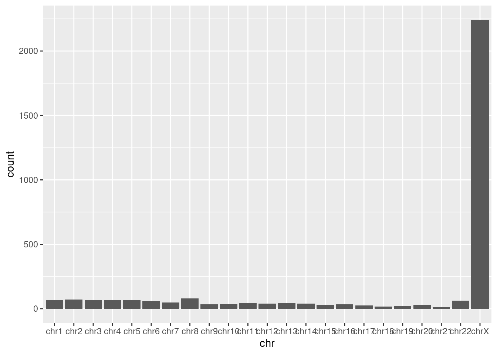
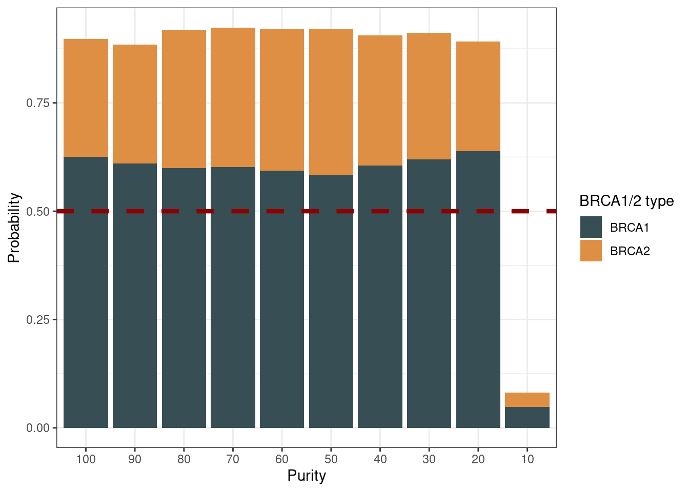

Mutational signature analysis of snvs
================

Seems HCC1937 had excessive mutations on chromosome X, this is because
this cellline has no normal chrX, instead, at least one copy of derived
X chromosome. I found most of them could be germline, thus variants on
chrX had been excluded in all signature analysis.

### The mutational spectrum in COLO829 gold standard

### The mutational spectrum in long read calls for COLO829

The signatures in samples of different purity levels

### The mutational spectrum in false positive calls

    Warning: Using an external vector in selections was deprecated in tidyselect 1.1.0.
    ℹ Please use `all_of()` or `any_of()` instead.
      # Was:
      data %>% select(af_col)

      # Now:
      data %>% select(all_of(af_col))

    See <https://tidyselect.r-lib.org/reference/faq-external-vector.html>.
    This warning is displayed once every 8 hours.
    Call `lifecycle::last_lifecycle_warnings()` to see where this warning was
    generated.

### The mutational spectrum in HCC1937 gold standard

### The mutational spectrum in long read calls

### The mutational spectrum in false positive calls in HCC1937

### HRD prediction using samples with different purity

    Warning in geom_col(aes(order = fct_rev(name)), position = "stack"): Ignoring
    unknown aesthetics: order

    Warning in geom_col(aes(order = fct_rev(name)), position = "stack"): Ignoring
    unknown aesthetics: order

    Warning in geom_col(aes(order = fct_rev(name)), position = "stack"): Ignoring
    unknown aesthetics: order

    Warning in geom_col(aes(order = fct_rev(name)), position = "stack"): Ignoring
    unknown aesthetics: order

### Extra: The signature analysis with FP SNVs

This result might be not that useful, since FP in callset will cause
overfitting. So should not included this is paper.

