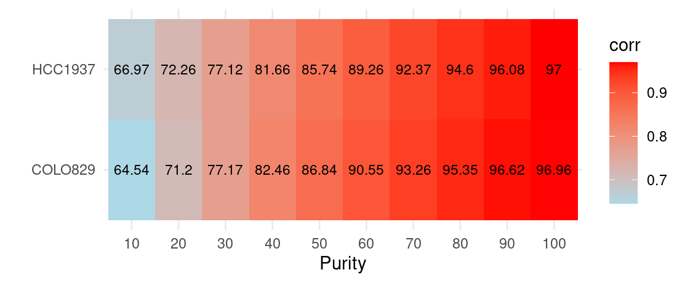
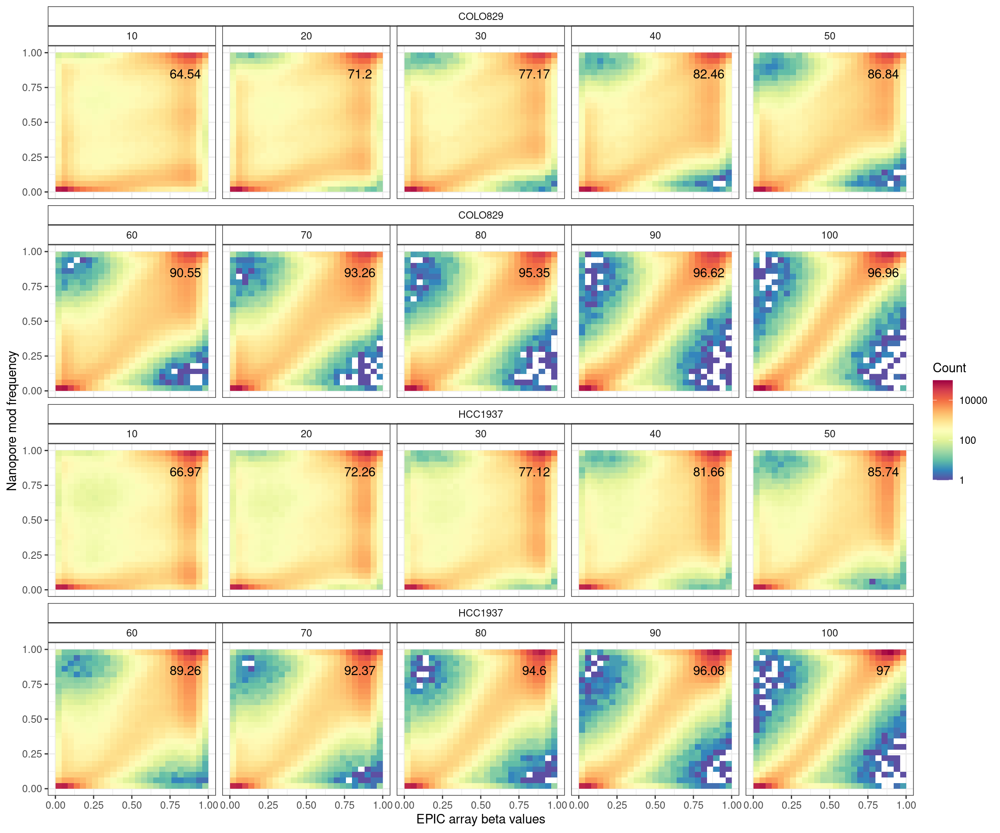
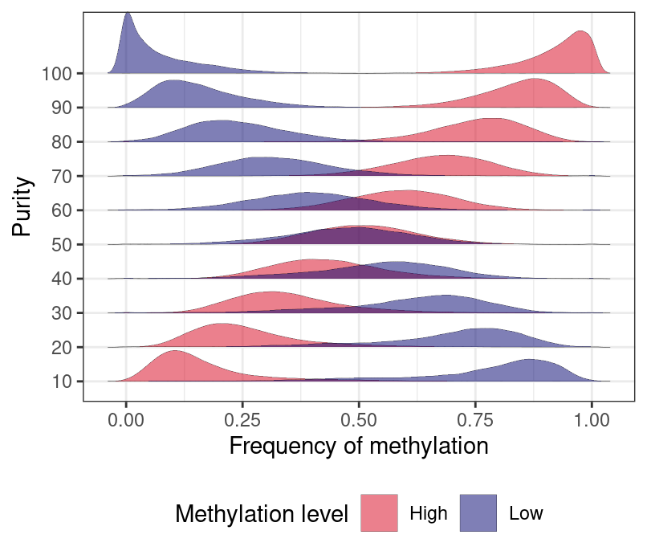
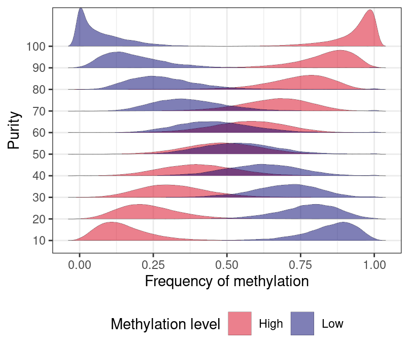

Methylation analysis
================

The methylation modification at CpG sites were predicted with remora,
and the methylation frequencies at each site were aggregated with
`modkit pilup`, with 5mC and 5hmC calculated separately. Here, we
compare the methylation frequency of 5mC and the epic array measures of
samples to evaluate the performance.

Firstly, we load the epic array results for COLO829 and HCC1937. Here,
we are only interested in methylation in tumour.

Then load the results from nanopore data

    Warning: Removed 1532 rows containing non-finite values (`stat_bin2d()`).

    Warning: Removed 1532 rows containing non-finite values (`stat_bin2d()`).

