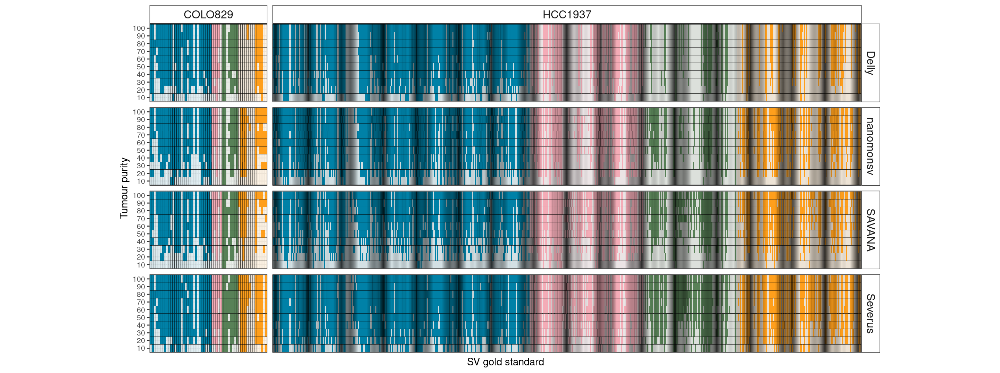

SV calling
================

We benchmarked the SV calling over purities using 4 somatic SV callers:
nanomonsv, severus, savana, and delly.

**1.delly**

``` bash
export OMP_NUM_THREADS=2 # delly primarily parallises on the sample level.
delly lr \
            -t ALL \
            -y ont \
            -o $output_bcf \
            -g $genome $tumor_bam $normal_bam
        
function get_sample_id() {
      echo "$(samtools view -H ${1} | perl -lne 'print ${1} if /\\sSM:(\\S+)/' | head -n 1 )"
}

TID=$(get_sample_id "$tumour_bam")
CID=$(get_sample_id "$normal_bam")
printf "${TID}\\ttumor\\n${CID}\\tcontrol\\n" > $samples_tsv

delly filter \
      -f somatic \
      -p \
      -s $samples_tsv \
      $output_bcf | bcftools view -Ov > $output_vcf
```

**2.nanomonsv**

``` bash
nanomonsv parse $tumor_bam $tumor
nanomonsv parse $normal_bam $normal

nanomonsv get $tumor $tumor_bam $genome \
        --control_prefix $normal --control_bam $normal_bam \
        --single_bnd --use_racon --min_indel_size 10 --qv20 \
        --control_panel_prefix $control_panel --processes 24
        
python3 misc/add_simple_repeat.py $input $ouptut $simple_repeat

head -n 1 $output > $passed_output 
tail -n +2 $output |grep PASS >> $passed_output

python3 misc/sv_type.py $passed_output $passed_outptu_with_svtype
```

**3.SAVANA**\*

``` bash
savana --tumour $tumour_bam \
        --normal $normal_bam \
        --ref $genome \
        --sample $tumor.$normal \
        --threads 24 \
        --outdir $outdir
```

**4.Severus**

``` bash
 severus --target-bam $hp_tagged_tumour_bam \
            --control-bam $hp_tagged_normal_bam \
            --out-dir $outdir \
            --threads 24 \
            --vntr-bed $vntr_bed \
            --phasing-vcf $phased_vcf
```

### COLO829


### HCC1937


Try facet_nested


without facet_nested


A general benchmarking


Currently, I think combining SVs detected by multiple tools is a good
strategy to call as many novel SV as possibly while keep confidence.
Here I compared the the intersect of four tools and pick any SVs that
are detected by at least two tools with short-read ‘gold standard’.


Seems it’s not improve the recall, it means SVs that are not detected by
Severus will not likely be detected by other tools we used as well.

## Pick short-read specific SVs that are not detected in all samples with all tools.

``` r
df_sv |> filter(cellline=="COLO829") |> 
  group_by(`#CHROM`, POS, ID, svtype, supp) |> 
  summarise(n=n()) |> ungroup() |>
  complete(supp, ID, fill = list(n=0)) |>  filter(n==0, supp=="2") |> 
  mutate(id=sub("^[01]_", "", ID)) |> 
  dplyr::select(id) |>write_tsv("../../3.igv_check/sr_specific/colo829.sr_specific.id", col_names = FALSE)

df_sv |> filter(cellline=="HCC1937") |> filter(`#CHROM`!="chrX") |> 
  group_by(`#CHROM`, POS,ID, svtype, supp) |> 
  summarise(n=n()) |> ungroup() |>
  complete(supp, ID, fill = list(n=0)) |>  filter(n==0, supp=="2") |> 
  mutate(id=sub("^[01]_", "", ID)) |> 
  dplyr::select(id) |> write_tsv("../../3.igv_check/sr_specific/hcc1937.sr_specific.id", col_names = FALSE)
```

## Merge SVs called by different tool


