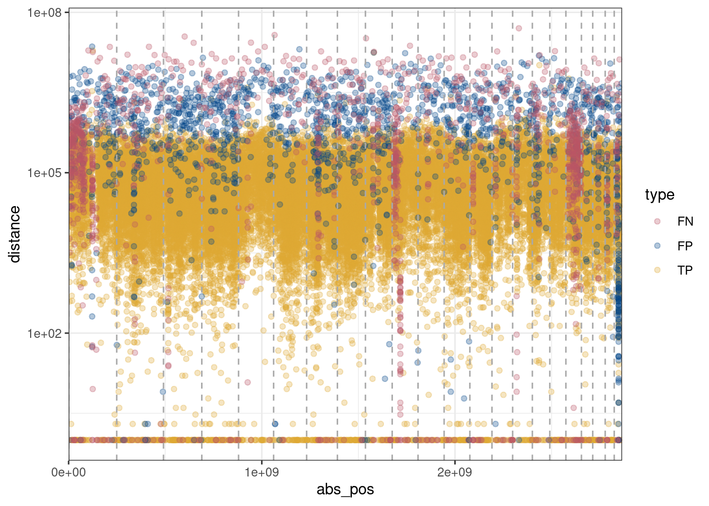

Genome stratification of FP and FN
================

Here, we study the genomic location of FP and FN calls with the genome
stratification from GIAB. This analysis is limited on chromosome 1-22.

## SNV FP and FN calls genome stratification

\## SNV FP and FN calls genome stratification with different purities
merged

## INDEL FP and FN calls genome stratification

## SV FP and FN calls genome stratification

Seem these plots don’t send a strong message. I change them to heatmaps.

### COLO829 using ClairS

    Warning: There was 1 warning in `arrange()`.
    ℹ In argument: `..3 = str_rank(chrom, nummeric = T)`.
    Caused by warning in `stri_opts_collator()`:
    ! Unknown option to `stri_opts_collator`.
    There was 1 warning in `arrange()`.
    ℹ In argument: `..3 = str_rank(chrom, nummeric = T)`.
    Caused by warning in `stri_opts_collator()`:
    ! Unknown option to `stri_opts_collator`.
    There was 1 warning in `arrange()`.
    ℹ In argument: `..3 = str_rank(chrom, nummeric = T)`.
    Caused by warning in `stri_opts_collator()`:
    ! Unknown option to `stri_opts_collator`.

    Warning: Removed 190 rows containing missing values (`geom_point()`).

    Warning: Removed 66 rows containing missing values (`geom_point()`).

    Warning: Removed 66 rows containing missing values (`geom_point()`).

### HCC1937 using ClairS

    Warning: There was 1 warning in `arrange()`.
    ℹ In argument: `..3 = str_rank(chrom, nummeric = T)`.
    Caused by warning in `stri_opts_collator()`:
    ! Unknown option to `stri_opts_collator`.
    There was 1 warning in `arrange()`.
    ℹ In argument: `..3 = str_rank(chrom, nummeric = T)`.
    Caused by warning in `stri_opts_collator()`:
    ! Unknown option to `stri_opts_collator`.

    Warning: One or more parsing issues, call `problems()` on your data frame for details,
    e.g.:
      dat <- vroom(...)
      problems(dat)

    Warning: There was 1 warning in `arrange()`.
    ℹ In argument: `..3 = str_rank(chrom, nummeric = T)`.
    Caused by warning in `stri_opts_collator()`:
    ! Unknown option to `stri_opts_collator`.

    Warning: Removed 73 rows containing missing values (`geom_point()`).

    Warning: Removed 66 rows containing missing values (`geom_point()`).

    Warning: Removed 66 rows containing missing values (`geom_point()`).

### COLO829 using deepsomatic

    Warning: There was 1 warning in `arrange()`.
    ℹ In argument: `..3 = str_rank(chrom, nummeric = T)`.
    Caused by warning in `stri_opts_collator()`:
    ! Unknown option to `stri_opts_collator`.
    There was 1 warning in `arrange()`.
    ℹ In argument: `..3 = str_rank(chrom, nummeric = T)`.
    Caused by warning in `stri_opts_collator()`:
    ! Unknown option to `stri_opts_collator`.
    There was 1 warning in `arrange()`.
    ℹ In argument: `..3 = str_rank(chrom, nummeric = T)`.
    Caused by warning in `stri_opts_collator()`:
    ! Unknown option to `stri_opts_collator`.

    Warning: Removed 190 rows containing missing values (`geom_point()`).

    Warning: Removed 66 rows containing missing values (`geom_point()`).

    Warning: Removed 66 rows containing missing values (`geom_point()`).

### HCC1937 using deepsomatic

    Warning: There was 1 warning in `arrange()`.
    ℹ In argument: `..3 = str_rank(chrom, nummeric = T)`.
    Caused by warning in `stri_opts_collator()`:
    ! Unknown option to `stri_opts_collator`.
    There was 1 warning in `arrange()`.
    ℹ In argument: `..3 = str_rank(chrom, nummeric = T)`.
    Caused by warning in `stri_opts_collator()`:
    ! Unknown option to `stri_opts_collator`.
    There was 1 warning in `arrange()`.
    ℹ In argument: `..3 = str_rank(chrom, nummeric = T)`.
    Caused by warning in `stri_opts_collator()`:
    ! Unknown option to `stri_opts_collator`.

    Warning: Removed 68 rows containing missing values (`geom_point()`).

    Warning: Removed 66 rows containing missing values (`geom_point()`).

    Warning: Removed 66 rows containing missing values (`geom_point()`).

### rainfall plots for indels

    Warning: There was 1 warning in `arrange()`.
    ℹ In argument: `..3 = str_rank(chrom, nummeric = T)`.
    Caused by warning in `stri_opts_collator()`:
    ! Unknown option to `stri_opts_collator`.
    There was 1 warning in `arrange()`.
    ℹ In argument: `..3 = str_rank(chrom, nummeric = T)`.
    Caused by warning in `stri_opts_collator()`:
    ! Unknown option to `stri_opts_collator`.
    There was 1 warning in `arrange()`.
    ℹ In argument: `..3 = str_rank(chrom, nummeric = T)`.
    Caused by warning in `stri_opts_collator()`:
    ! Unknown option to `stri_opts_collator`.

    Warning: Removed 66 rows containing missing values (`geom_point()`).

    Warning: Removed 64 rows containing missing values (`geom_point()`).

