How I built the gold standard with short-read data and comparison of
callset and the published COLO829 gold standard
================

## SNV gold standard construction

We had three biological replication library for cell line COLO829 and
HCC1937, each sequenced with short-read illumina sequencing with high??
depth, and processed with our pipeline. I get the those SNVs that are
shared by at least two libraries.

For SNV, I need to atomise MNV to assure the all can be merged.

``` bash
## step1: norm MNV and multiallelic sites for each callset
for vcf in snv/*.sp.snpVcf.vcf.gz;do
    prefix=`basename $vcf .sp.snpVcf.vcf.gz`
    bcftools norm -a -m - -Oz -o snv/$prefix.normed.vcf.gz $vcf 
    tabix -p vcf snv/$prefix.normed.vcf.gz
done

## step2: get the intersect
bcftools isec snv/*.normed.vcf.gz -p isec_snv_dir/

## step3: index intersect sites
bgzip -f isec_snv_dir/sites.txt
tabix -s1 -b2 -e2 isec_snv_dir/sites.txt.gz

## step4: define TAG for vcf header
echo "##INFO=<ID=ISEC,Number=1,Type=String,Description=\"intersection code\">" > annots.header

## step 5: merge normed vcf files and  add new TAG in vcf
bcftools merge snv/*.normed.vcf.gz |\
    bcftools norm -m - | \
    bcftools annotate -a isec_snv_dir/sites.txt.gz \
    -h annots.header \
    -c CHROM,POS,REF,ALT,ISEC \
    --write-index -Oz -o merged_normed_isec_snv.vcf.gz##idx##merged_normed_isec_snv.vcf.gz.tbi

## step6: get the at least shared-by-two snvs as gold standard.
bcftools filter -i 'INFO/ISEC="111" | INFO/ISEC="110" | INFO/ISEC="101" | INFO/ISEC="011"'  merged_normed_isec_snv.vcf.gz |bgzip -f > merged_normed_isec_snv.goldstandard.vcf.gz
tabix -p vcf  merged_normed_isec_snv.goldstandard.vcf.gz
```

Similar method for INDEL, just without atomisation.

``` bash
## step1: get the intersect
bcftools isec indel/*.sp.indelVcf.vcf.gz -p isec_indel_dir/

## step2: index intersect sites
bgzip -f isec_indel_dir/sites.txt
tabix -s1 -b2 -e2 isec_indel_dir/sites.txt.gz

## step3: define TAG for vcf header
#echo "##INFO=<ID=ISEC,Number=1,Type=String,Description=\"intersection code\">" > annots.header

## step4: merge normed vcf files and  add new TAG in vcf
bcftools merge indel/*.sp.indelVcf.vcf.gz |\
    bcftools norm -m - | \
    bcftools annotate -a isec_indel_dir/sites.txt.gz \
    -h annots.header \
    -c CHROM,POS,REF,ALT,ISEC \
    --write-index -Oz -o merged_normed_isec_indel.vcf.gz##idx##merged_normed_isec_indel.vcf.gz.tbi


bcftools filter -i 'INFO/ISEC="111" | INFO/ISEC="110" | INFO/ISEC="101" | INFO/ISEC="011"'  merged_normed_isec_indel.vcf.gz |bgzip -f > merged_normed_isec_indel.goldstandard.vcf.gz
tabix -p vcf  merged_normed_isec_indel.goldstandard.vcf.gz
```

> > the original calls get filtered with HOM cut-off of 6, I lift this
> > filter by re-run `qannotate`.

``` bash
for analysisPath in `cat $report |cut -d"," -f61`; do
    raw_snp=$(find ${analysisPath} -name "*.snpVcf.vcf.gz"|grep -vE "sp|gp")
    prefix=`basename $raw_snp .snpVcf.vcf.gz`
    java -jar ${qannotate} --mode confidence -i $raw_snp -o snv/${prefix}.conf_homopolyer100.vcf.gz --log snv/${prefix}.qannotate.confidence.vcf.log -homCutoff 100
    java -jar ${qannotate} --mode vcf2maf -i snv/${prefix}.conf_homopolyer100.vcf.gz -o snv/${prefix}.maf --log snv/${prefix}.qannotate.vcf2maf.log
    zcat snv/${prefix}.Somatic.Pass.vcf.gz |bgzip > ${prefix}.tmp
    mv ${prefix}.tmp snv/${prefix}.Somatic.Pass.vcf.gz
    tabix -p vcf snv/${prefix}.Somatic.Pass.vcf.gz
done
```

The number of gold standard SNVs and INDELs


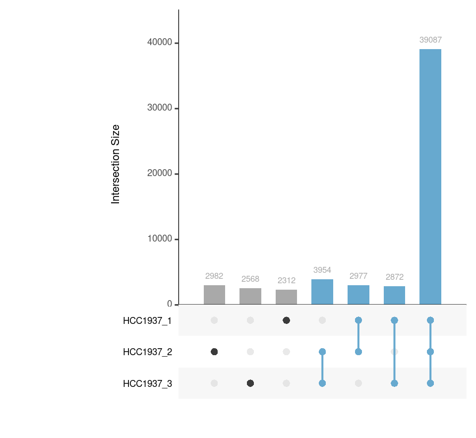

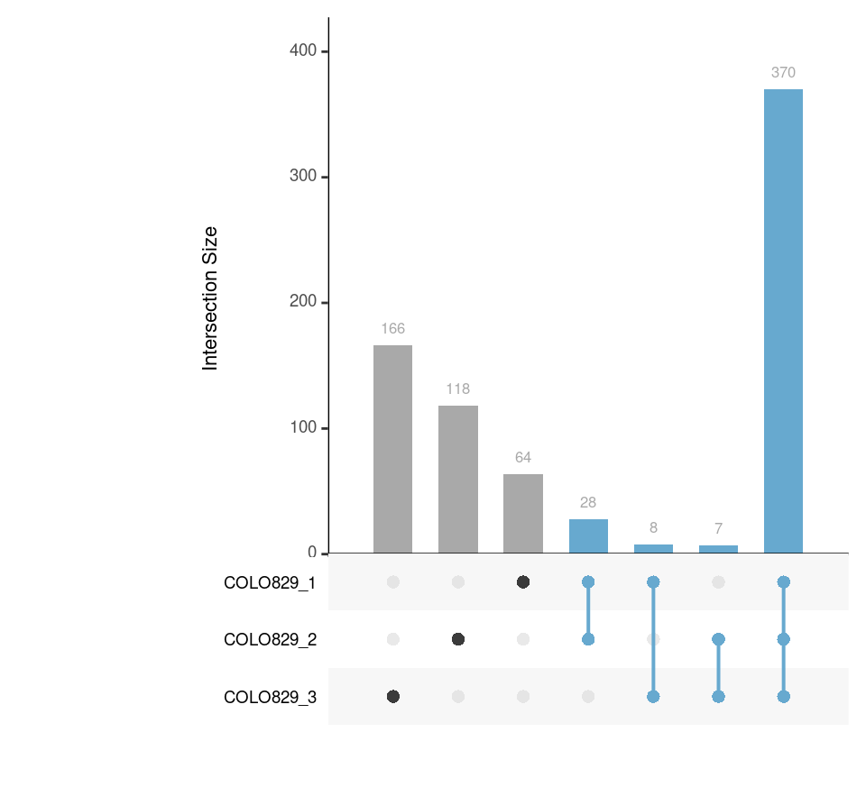

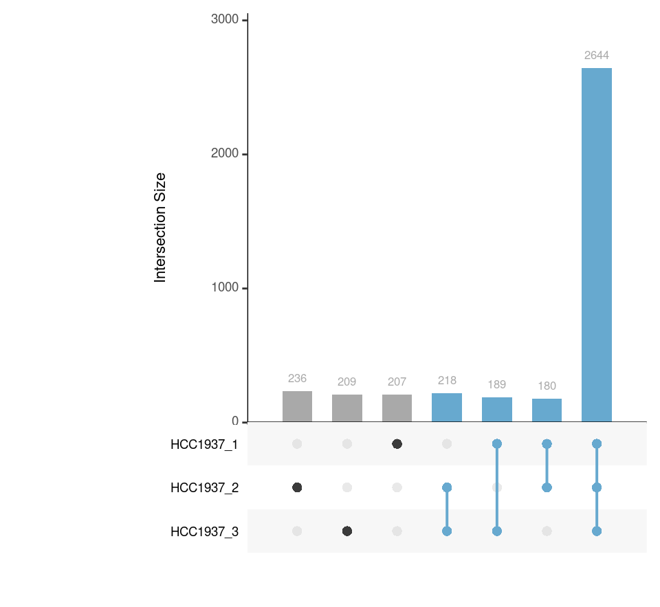

The number of gold standard SVs

- Firstly, I merged results from three tools, and get events that are
  presenting in at least two tools.

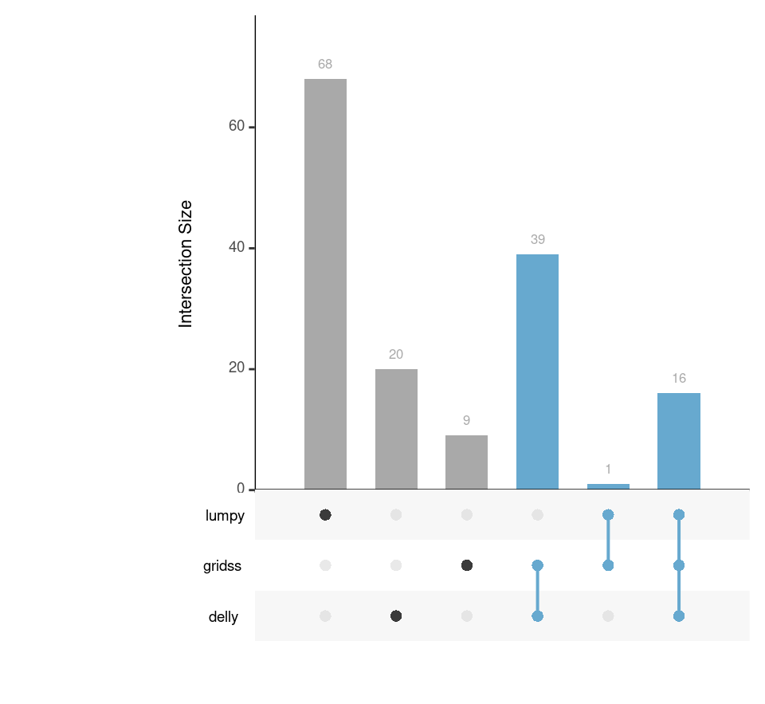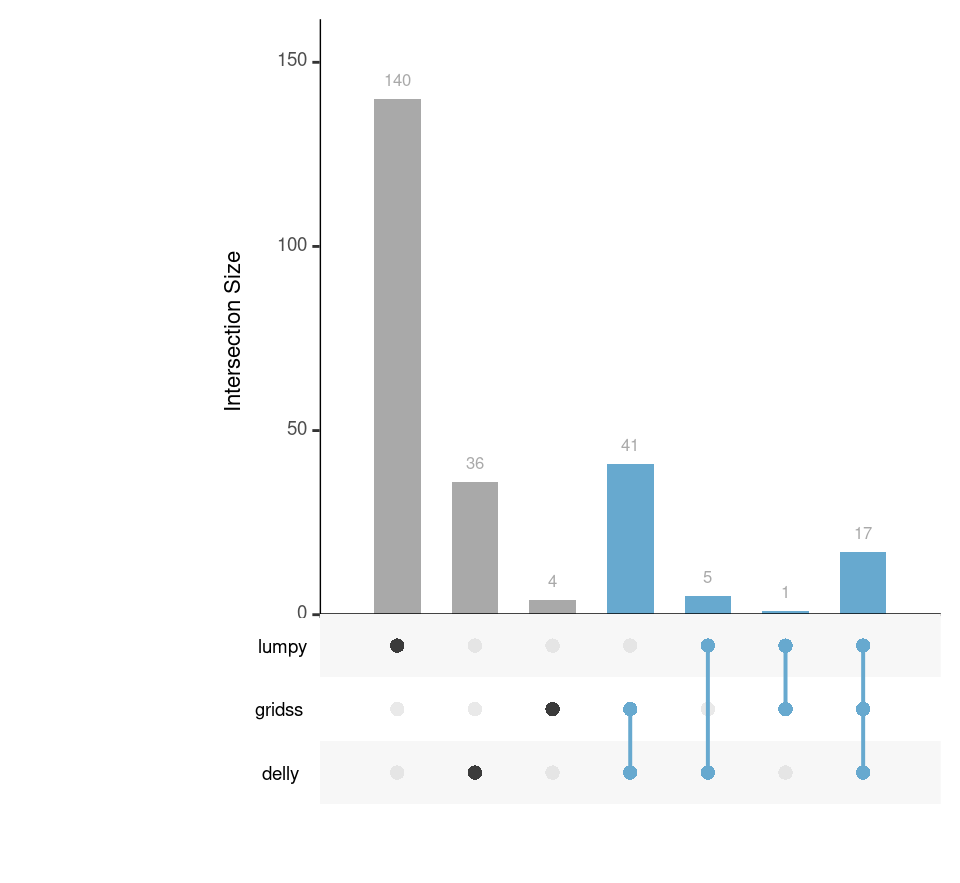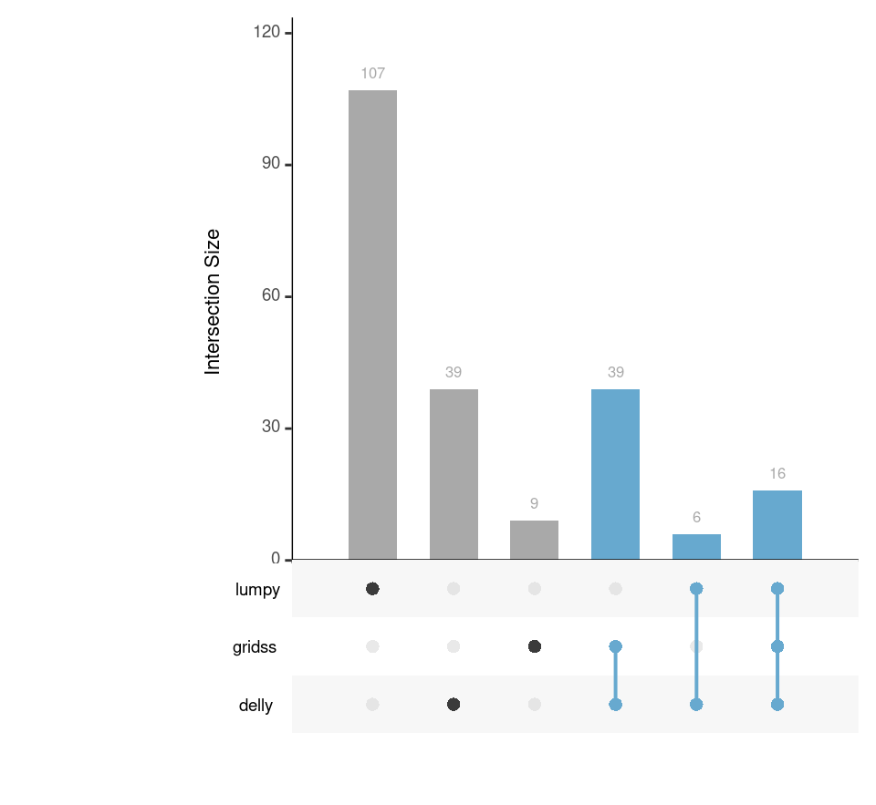

- Finally, I merged concordant SVs from three libraries, and get the
  final gold standard.
  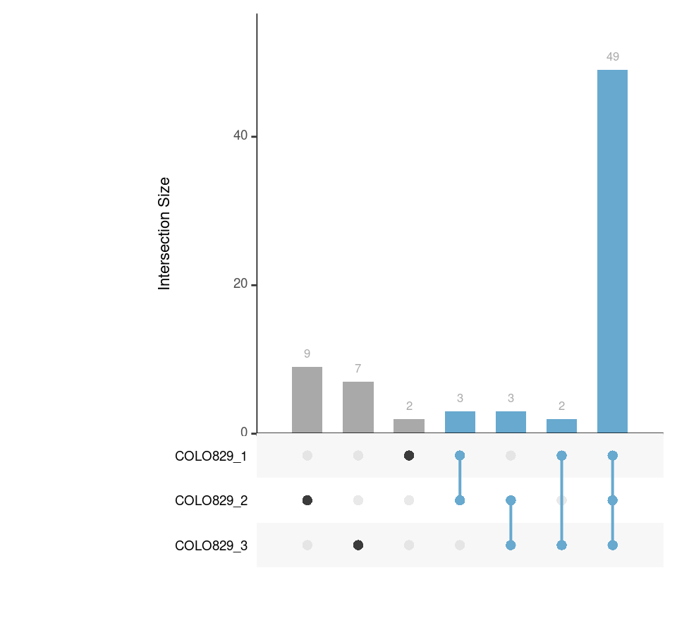

The same for HCC1937

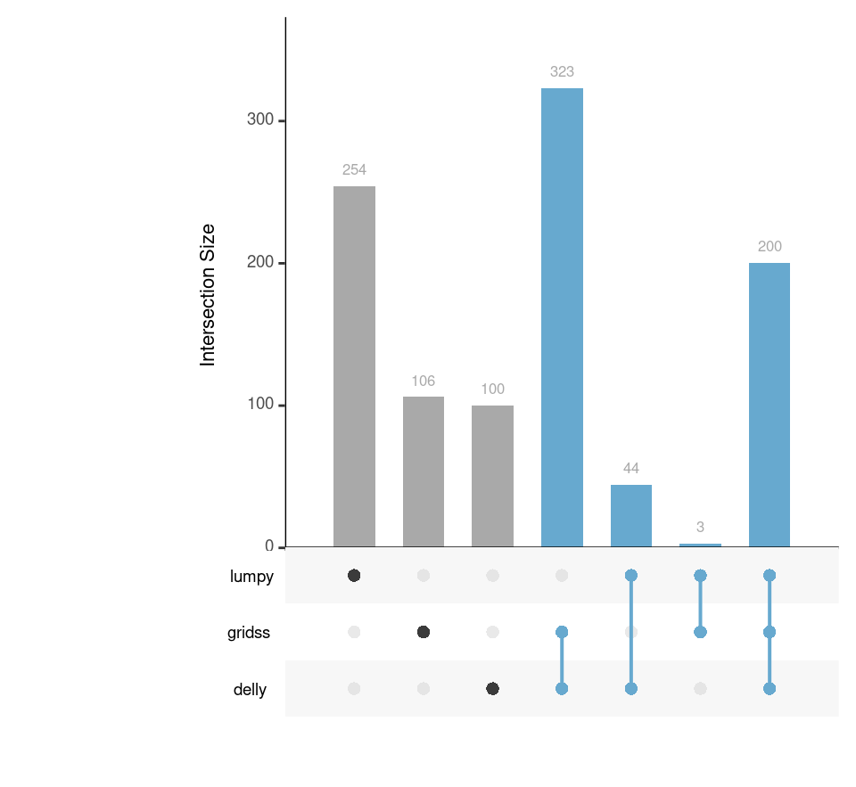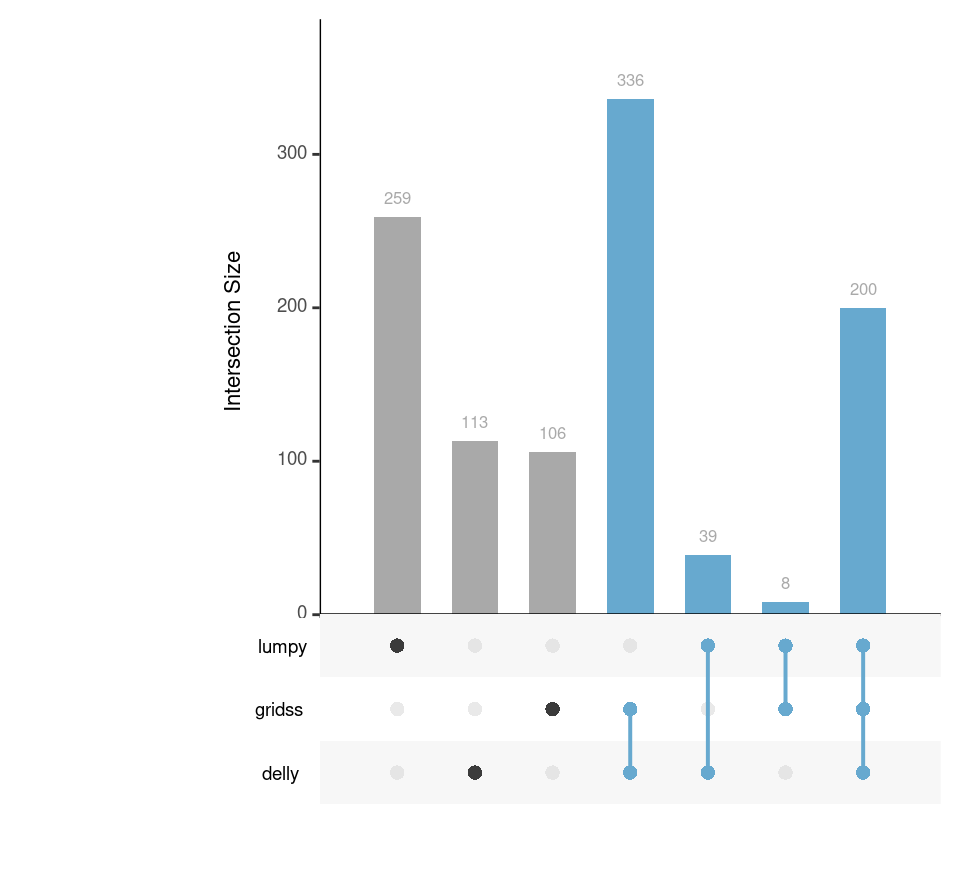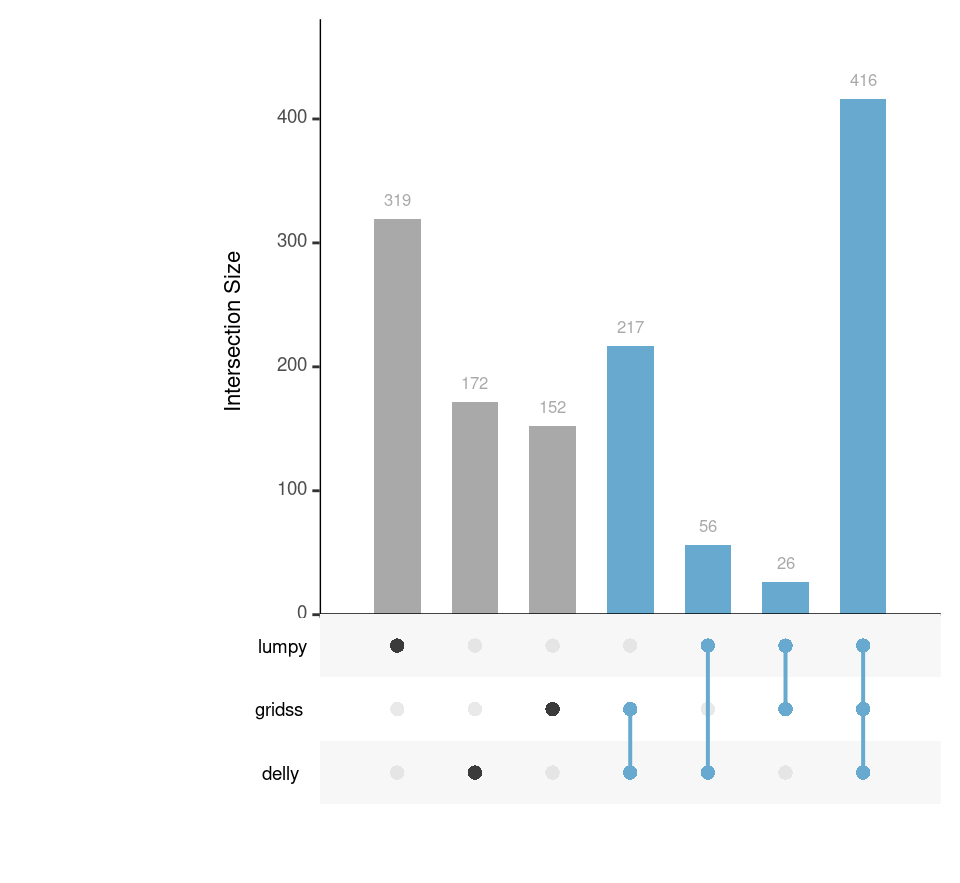

- Finally, I merged concordant SVs from three libraries, and get the
  final gold standard.
  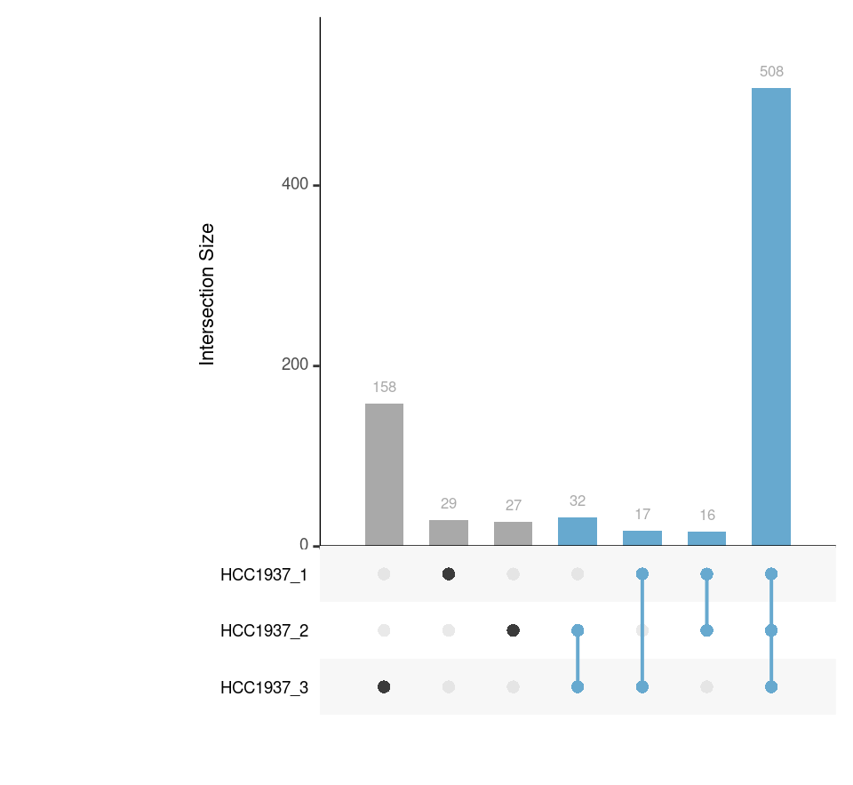

There are published and well-constructed COLO829 truthset of 68 SV
events. here I benchmark with the public one and compare the results
with our gold standard set.

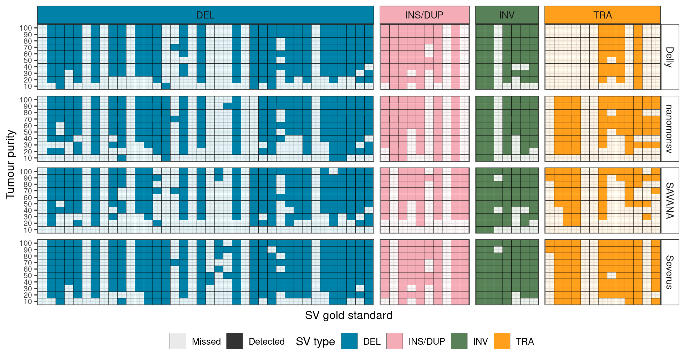

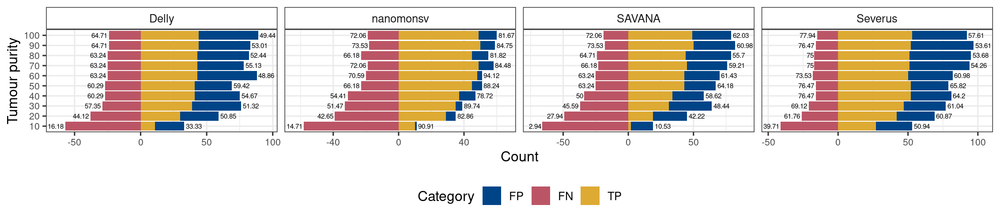
