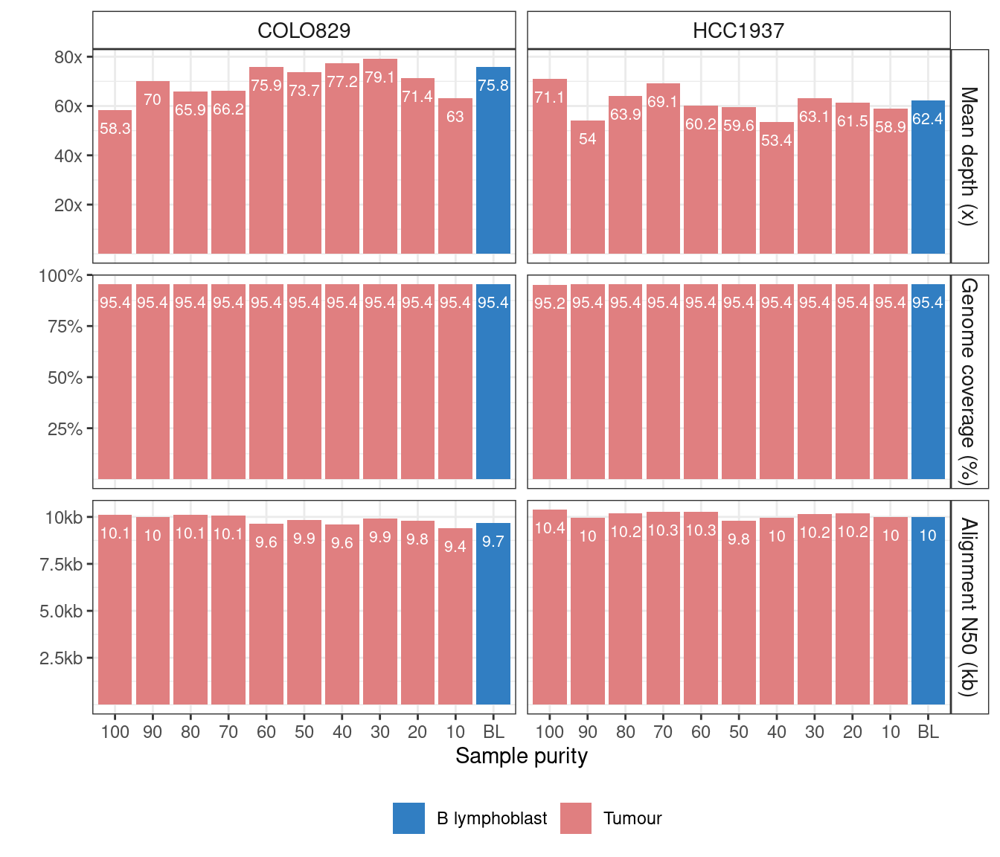

## Sequencing depth

Overall read depth for each sample was assessed using [mosdepth](https://github.com/brentp/mosdepth), and the sequencing depth ranged from 53.4 to 79.1x as shown below.
.

We generated 9 combinations of tumour-normal read depth with the situation that either tumour samples had the same depth or higher depth than normal samples using [helper.smk](helper.smk).

To evaluate the impact of read depth to variant calling using LRS, we sub-sampled BAM files using `samtools view`. Details described in [1.simulate_seq_depth.smk](1.simulate_seq_depth.smk).

As samtools randomly sample reads from BAM file but LRS has varied read length, we used `mosdepth` to check the read depth again after sub-sampling as in [0.depth_check.md](R_analysis/0.depth_check.md)