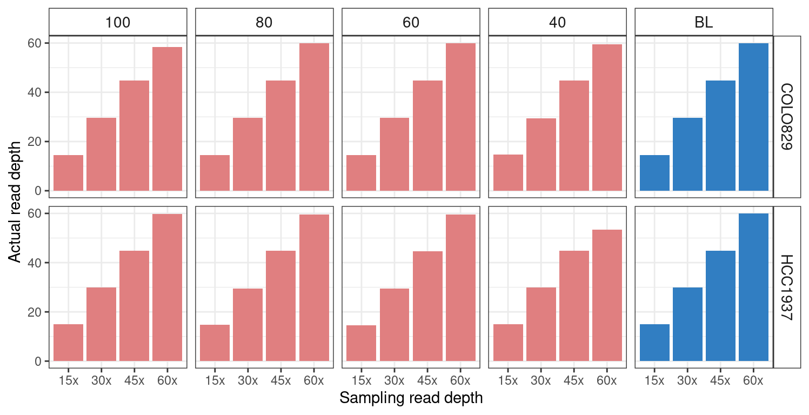

Check the simulated bam depth
================

I simulated sequencing depth from the original aligned bam using
`samtools view`. However, since the read length vary a lot in long read
sequencing, I need to check if the sequencing depths are actually right.

Looks perfect, nothing to worry.
