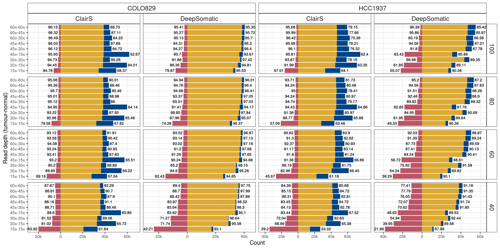
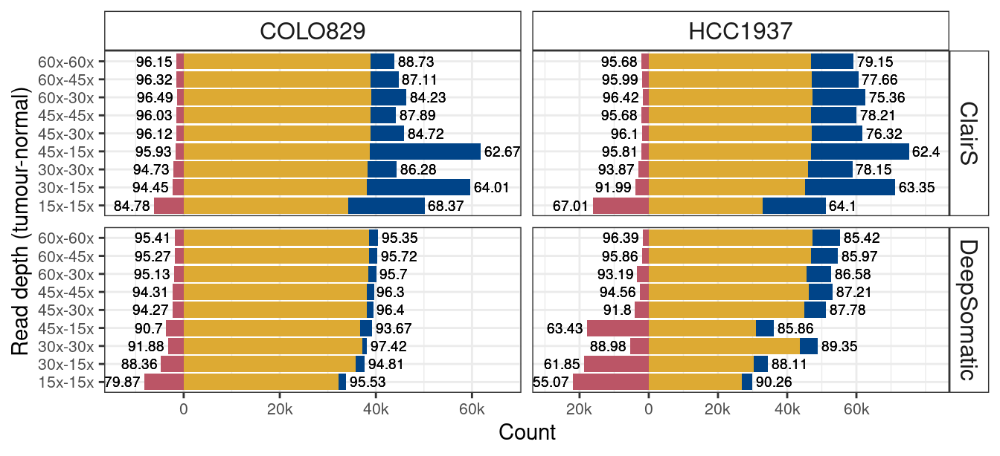
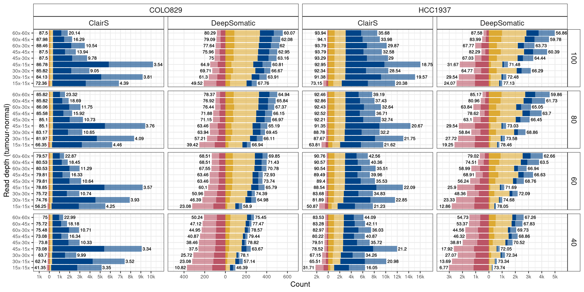
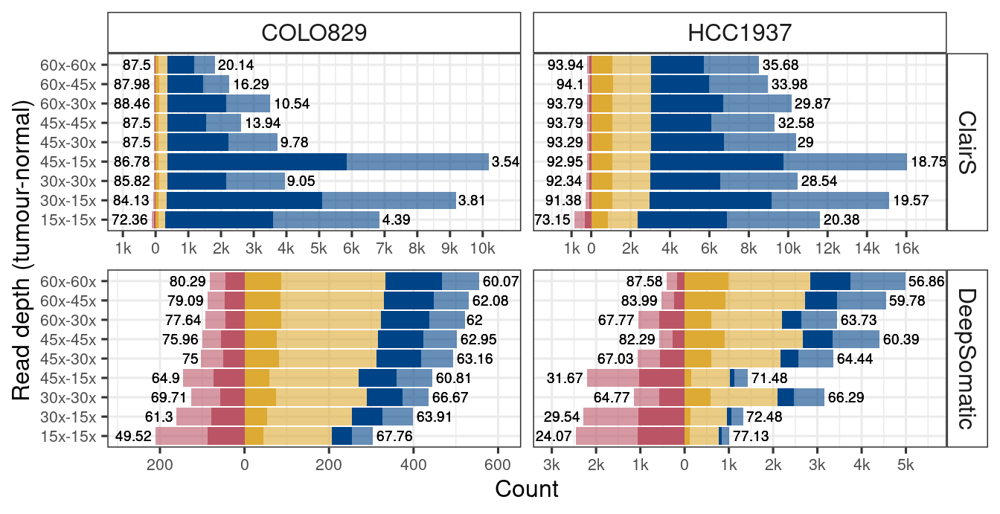
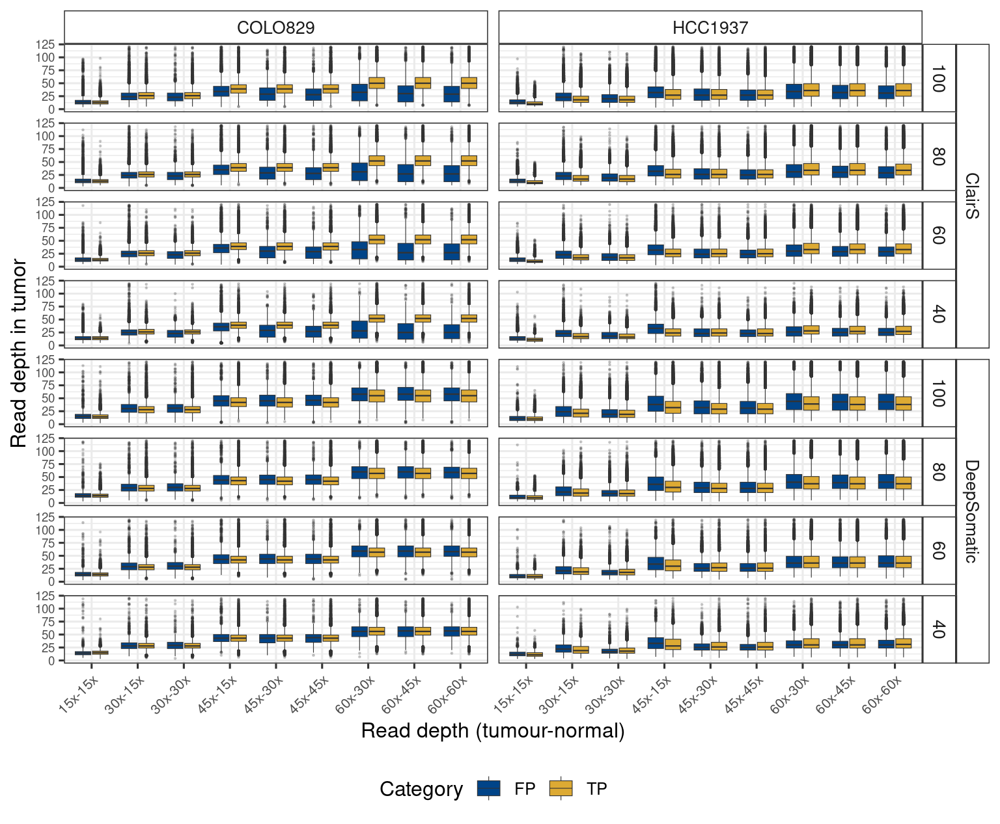
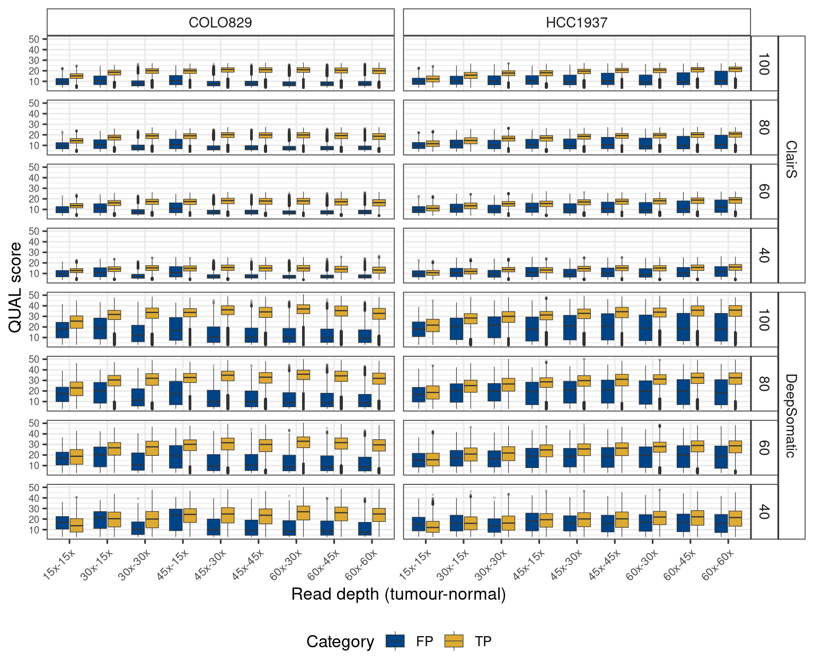
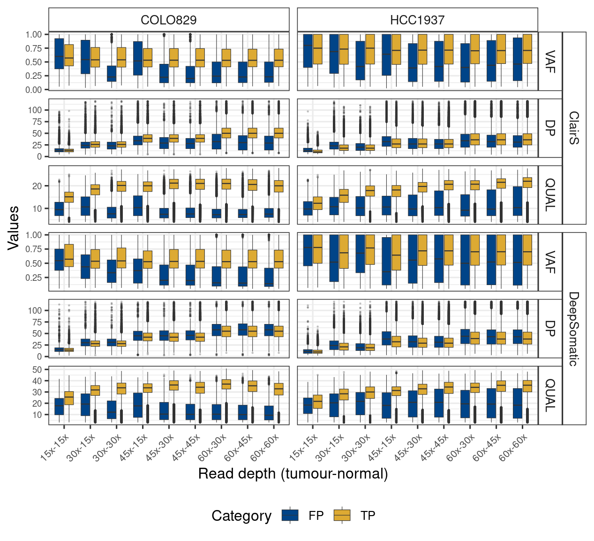
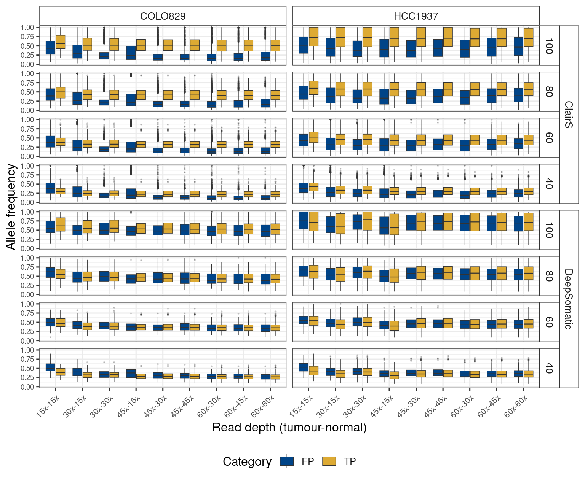
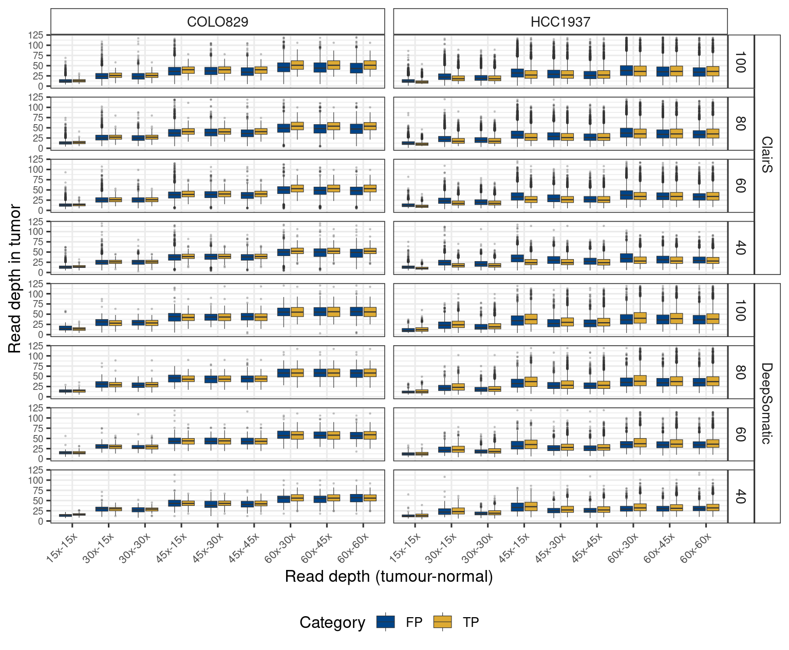
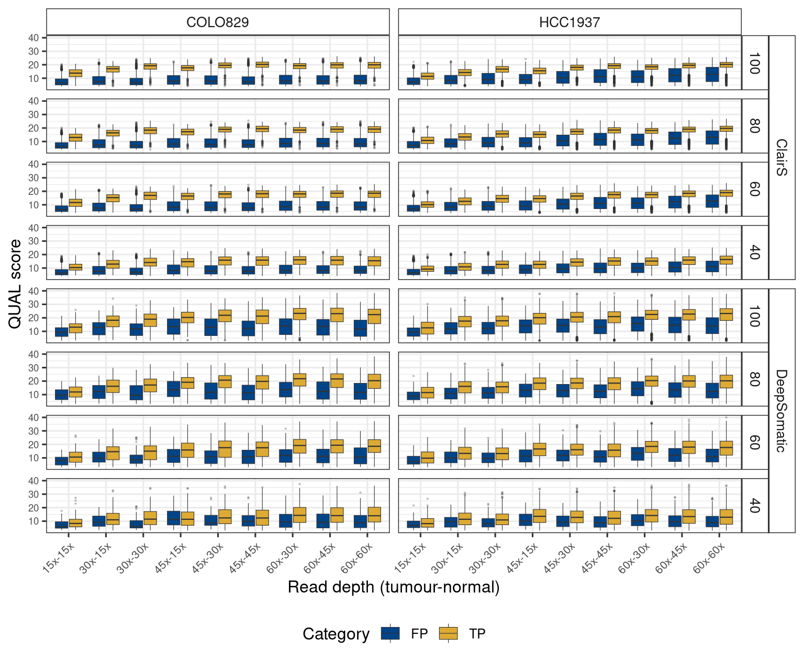

Cell lines Mixing experiment
================

### The choice of sequencing Variant calling

plot F1 score instead of recall and precision

## try heatmap

## keep improving the figure

## Begin again

Begin again, start from something really simple. I need to know the \#
of SNV detected by different sequencing strategies. so under the sample
tumour sequencing depth, how many SNVs called in different normal
sequencing depth.

**only plot the sample with 100% tumour purity**

## indels

**only plot the results for sample with 100% purity**

**only plot for samples with 100% purity**

not very interesting. let’s have a look of the indels

