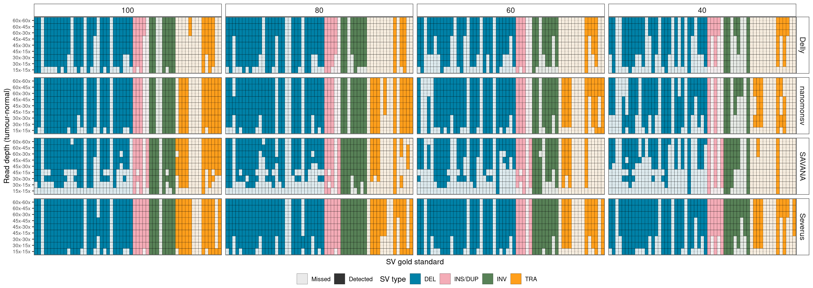
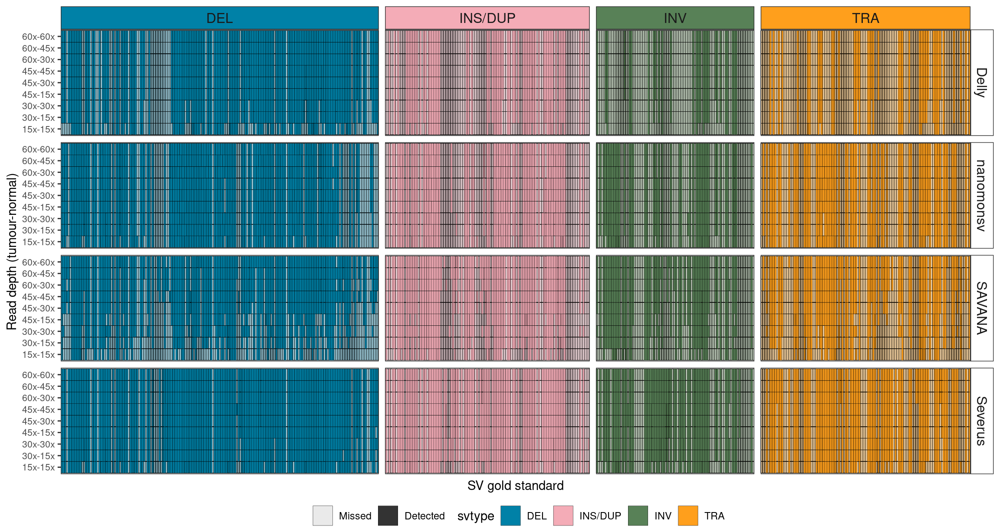
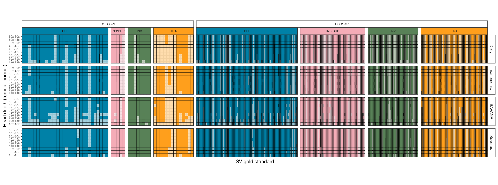
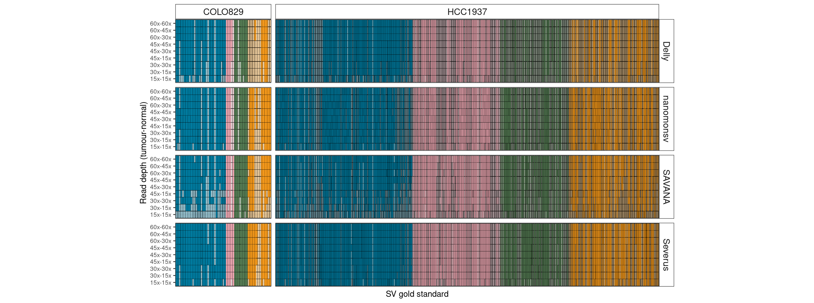
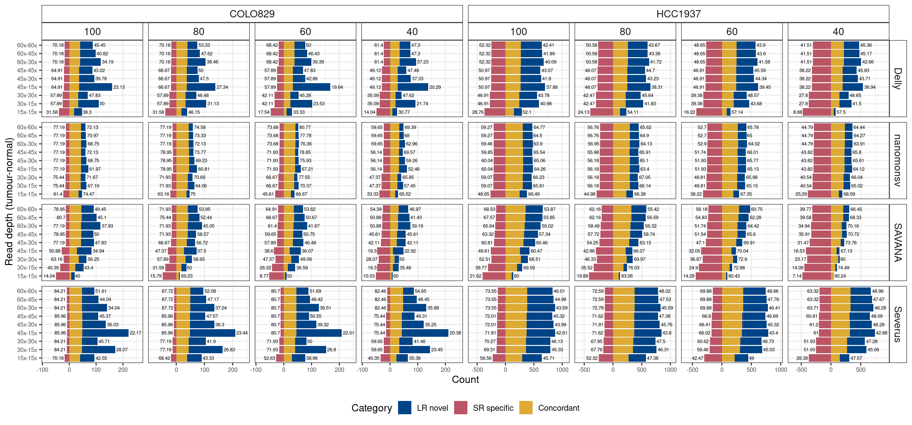
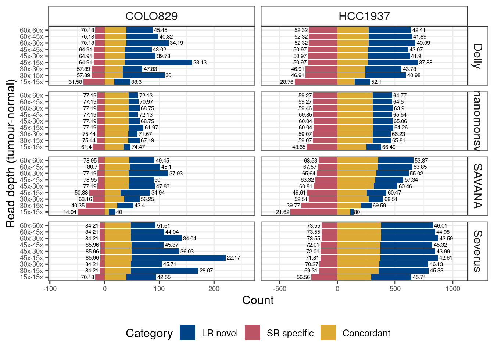
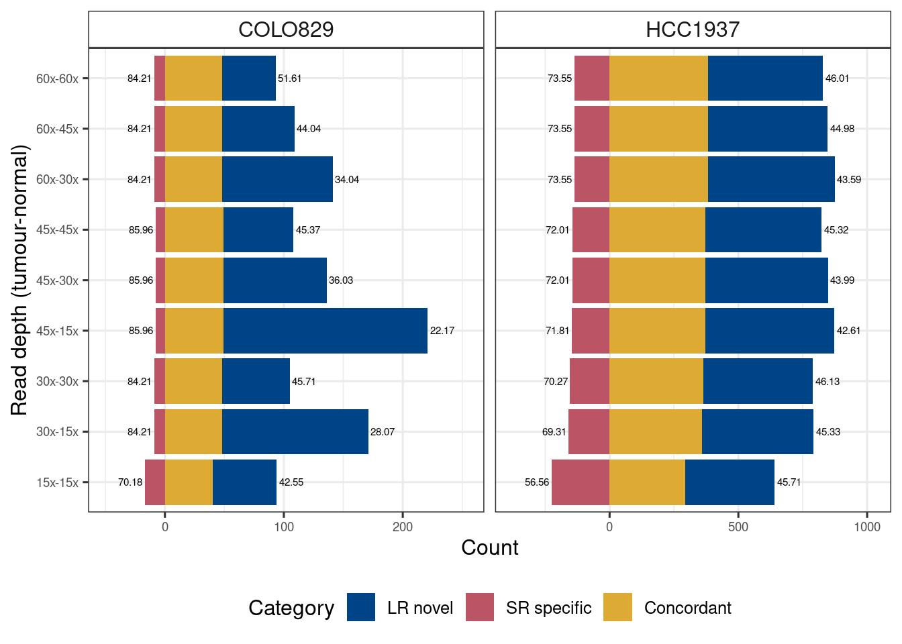
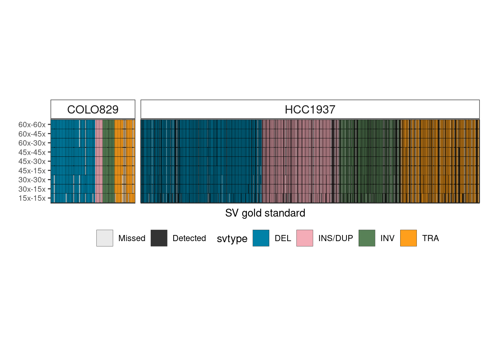
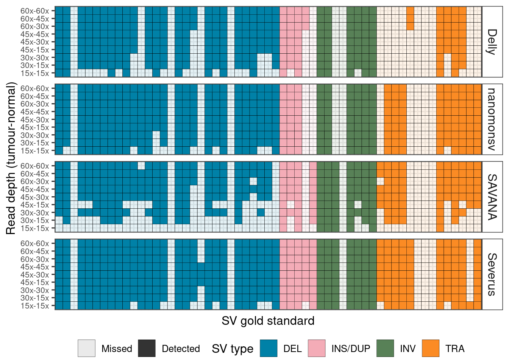

SV calling
================

We benchmarked the SV calling over purities using 4 somatic SV callers:
nanomonsv, severus, savana, and delly.

### COLO829

### HCC1937

because this is too long, I merged samples from different purity

Try facet_nested

without facet_nested

A general benchmarking

\`\`\`
