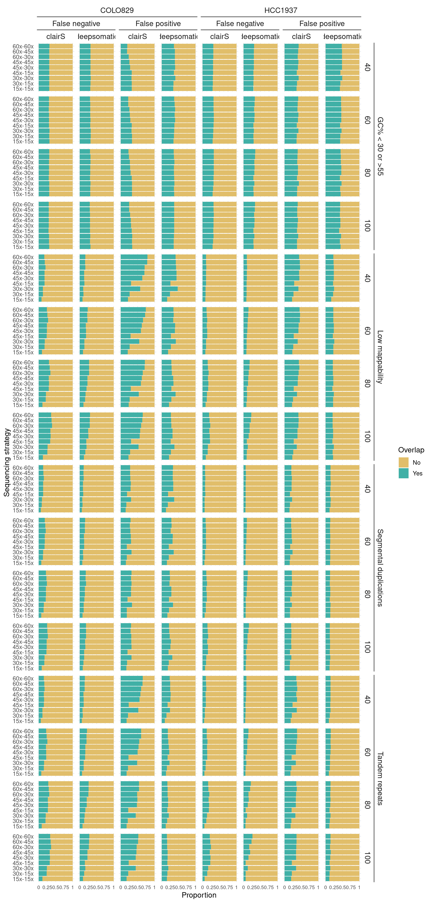
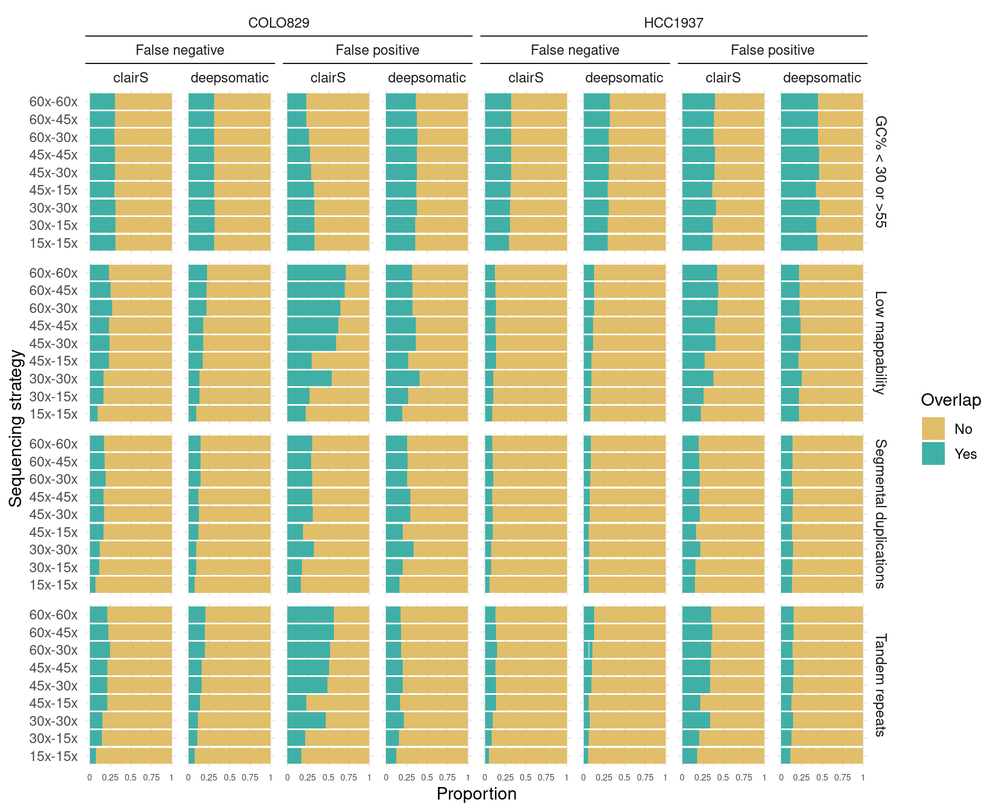
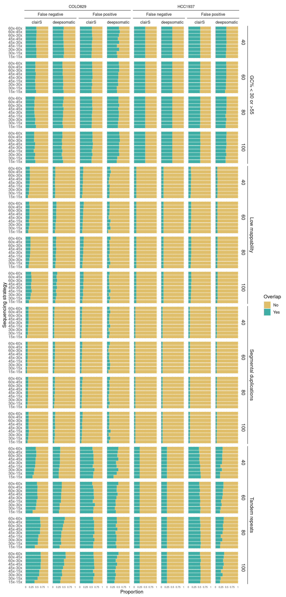
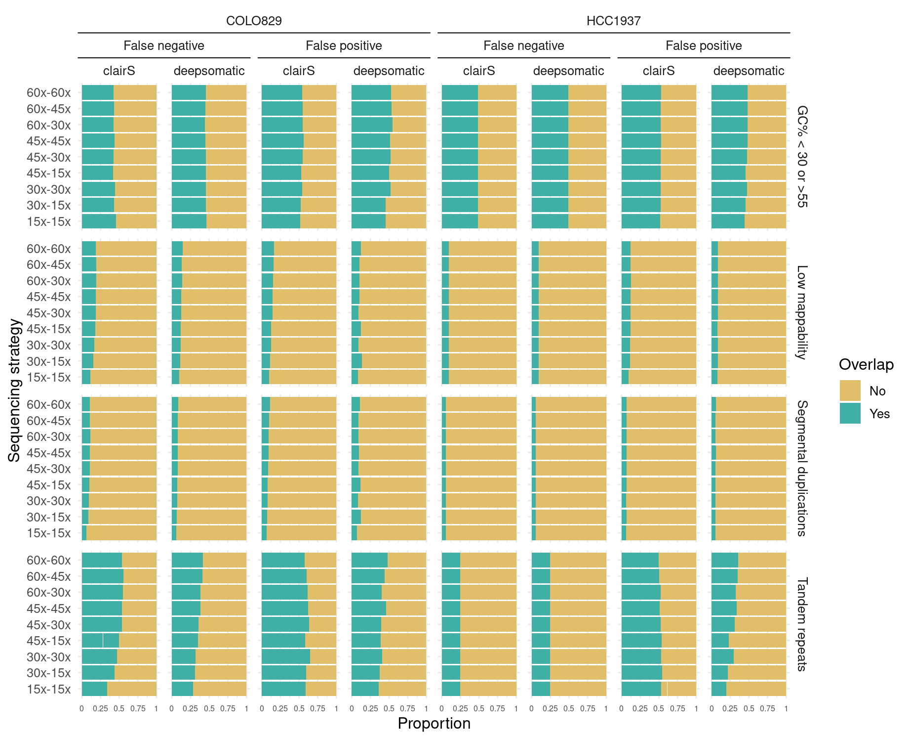
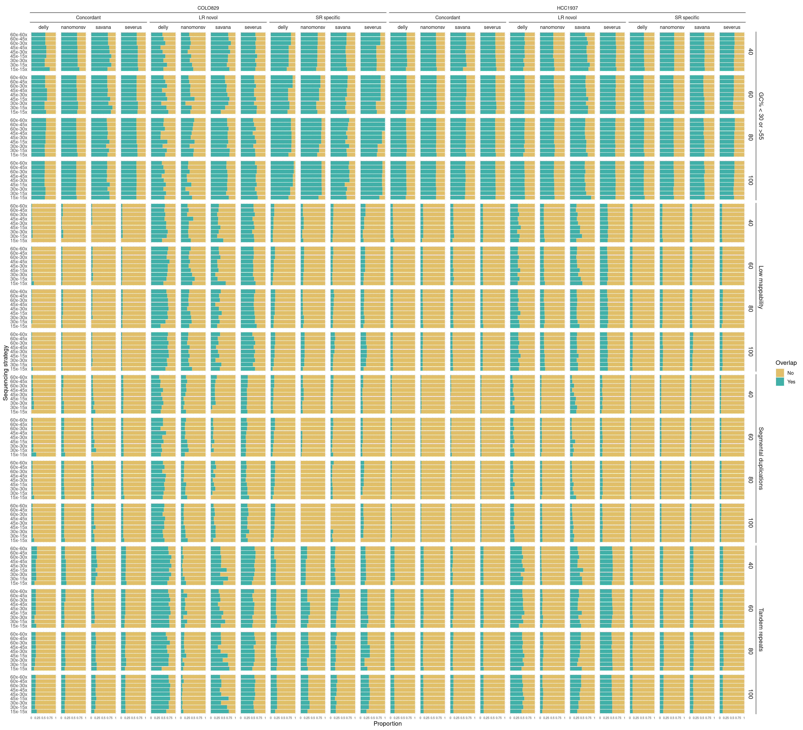
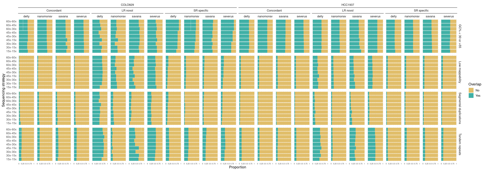

Genome stratification of FP and FN
================

Here, we study the genomic location of FP and FN calls with the genome
stratification from GIAB.

## SNV FP and FN calls genome stratification

## SNV FP and FN calls genome stratification with samples with different purity been merged

## INDEL FP and FN calls genome stratification

## INDEL FP and FN calls genome stratification with samples with different purity been merged

## SV FP and FN calls genome stratification

## SV FP and FN calls genome stratification with samples with different purity been merged

