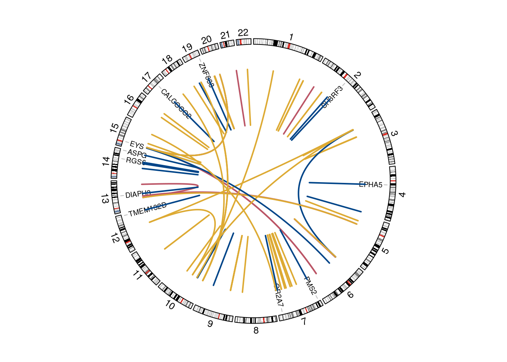
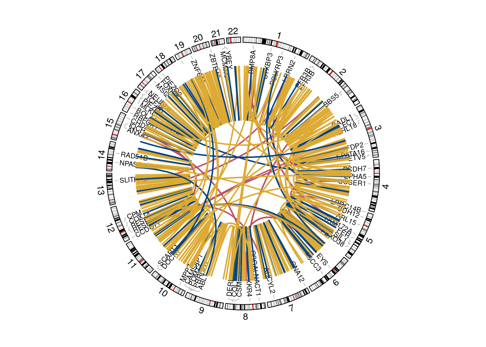

Circos plots of structural variants
================

Here, I investigated the genome distribution of structure variants in
COLO829 and HCC1937, and what genes those LR unique SVs impacted. For
COLO829, the number of SVs is small to show in a Circos plot but for
HCC1937 which is featured with many SVs they circos plot are not very
clear.

## COLO829

## HCC1937

