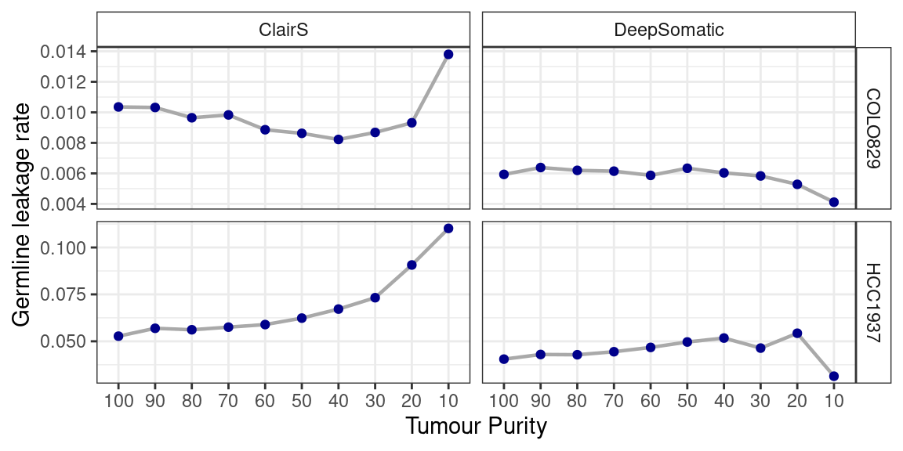
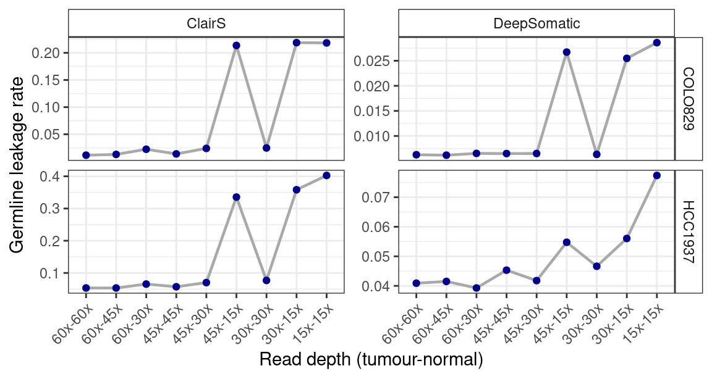

Germline leakage
================

Somatic variant detection pipelines can mistakenly identify germline
variants as somatic ones, a process called “germline leakage”. Here I
evaluate how germline leakage affected by tumour purity and sequencing
depth. To estimate the germline leakage rate, calculate the proportion
of SNVs in the somatic calls with a max population frequency \> 0.1 in
the gnomAD database. Note that this is just a rough estimate which help
me to compare across conditions.

Seems the tumour purity didn’t impact much in terms of germline leakage.
However, for sample with less then 30% tumour purity, ClairS calls had
increased germline leakage whereas DeepSomatic showed decreased germline
leakage rate.

**How about sequencing depth?**

The germline leakage rate spiked when germline sample sequenced at 15x
depth.
