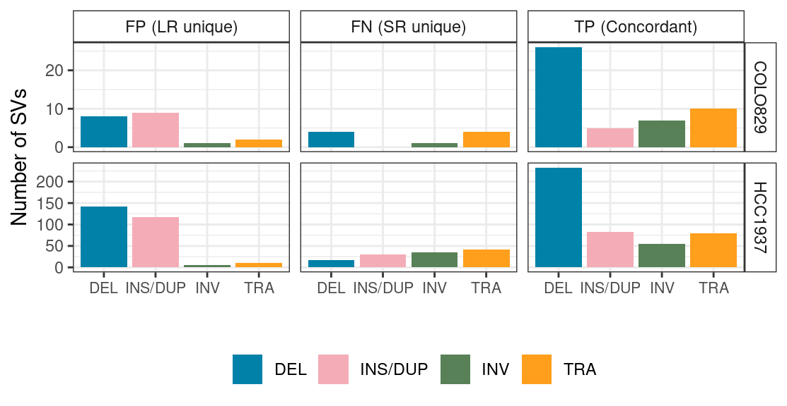
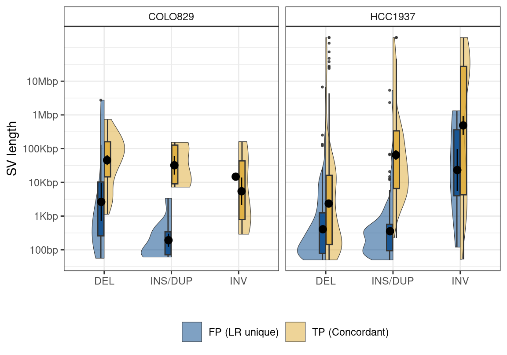

Untitled
================

With the hypothesis that unique SVs detected by long reads are
potentially real, I investigate the type and length distribution of
those SVs.

There are most DEL and INS/DUP identified by LR.

| svtype  | suppvec |  meanlen |
|:--------|:--------|---------:|
| DEL     | 01      |    225.5 |
| DEL     | 10      | 119993.0 |
| DEL     | 11      |   2024.0 |
| INS/DUP | 01      |    284.5 |
| INS/DUP | 10      | 139625.5 |
| INS/DUP | 11      |  35712.0 |
| INV     | 01      |  15333.0 |
| INV     | 10      |  24977.0 |
| INV     | 11      | 206353.0 |

