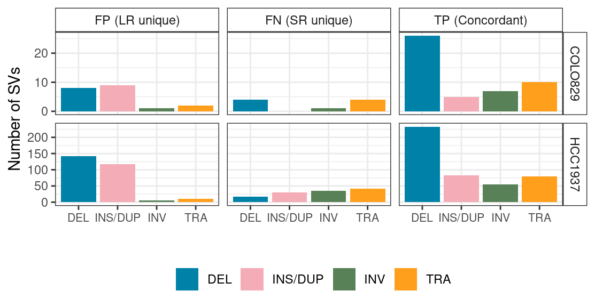
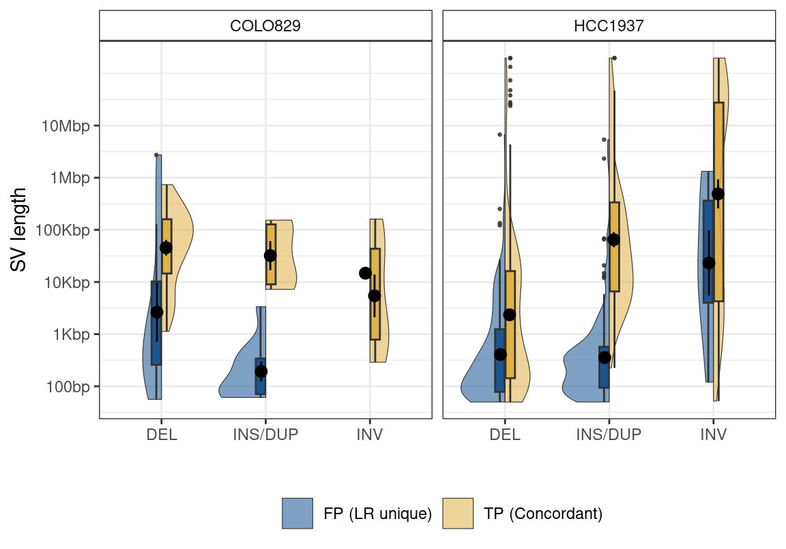

SV length and type in LRS
================

With the premise that unique SVs detected by long reads are potentially
real, I investigate the type and length distribution of those SVs.

LR unique SVs are most DEL and INS/DUP. What about their length
distribution? Long read suppose can easy capture the full inserted
length of deleted segment in a single read.

| SV type | Type           | Median SV length |
|:--------|:---------------|-----------------:|
| DEL     | Concordant     |           2024.0 |
| DEL     | FN (SR unique) |         119993.0 |
| DEL     | FP (LR unique) |            225.5 |
| INS/DUP | Concordant     |          35712.0 |
| INS/DUP | FN (SR unique) |         139625.5 |
| INS/DUP | FP (LR unique) |            284.5 |
| INV     | Concordant     |         206353.0 |
| INV     | FN (SR unique) |          24977.0 |
| INV     | FP (LR unique) |          15333.0 |

