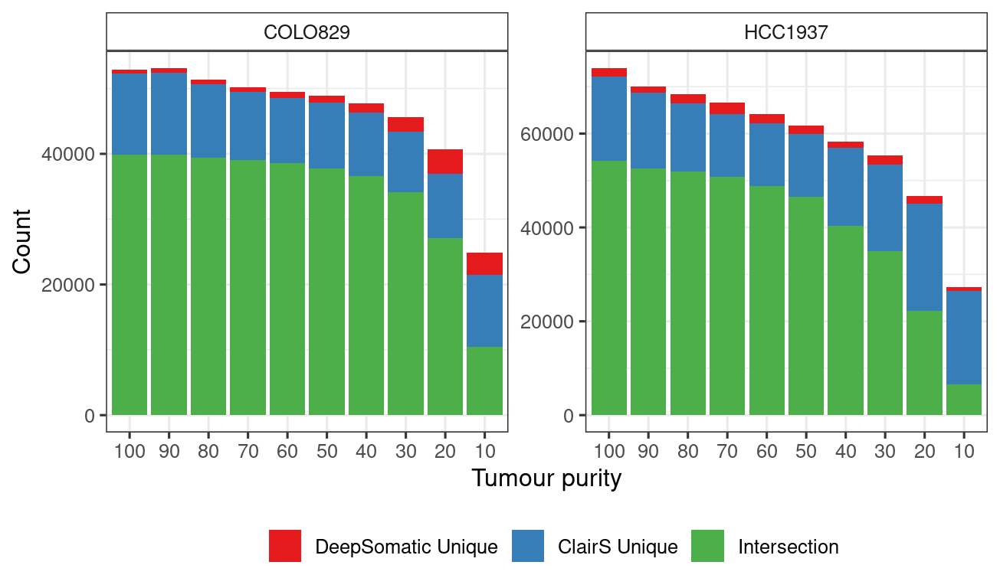

Overlapped SNV calls
================

This notebook contains analysis performed to address Reviewer \#1’s
comment:

> Weakness 1. The lack of analysis for overlapping true positives or
> false positives across methods was a missed opportunity to understand
> the potential impact of ensemble methods. Albeit, an analysis of
> overlapping calls is slightly out of scope of this work. Therefore, I
> do not see overlap analysis as a necessary revision.

All scripts we ran to generate the summary of overlapped SNVs from
ClairS and DeepSomatic are included in
[intersect_snvs.smk](../intersect_snvs.smk).

We found that large proportion of both methods are overlapped, especally
for DeepSomatic, there were not many DeepSomatic unique SNVs.

As expected, the recall is slightly lower compared with each single
method but higher precision. In addition, the union calls have higher
recalls. In the future, using union calls and integrated with filters
which take context (allele frequency, read depth, quality scores and
even genomic regions) might be a good strategy be produce high
confidence variant calling.

| Cell line | Tumour Purity | Precison of Intersection | Recall of Intersection | Recall of Union |
|:----------|:--------------|-------------------------:|-----------------------:|----------------:|
| COLO829   | 100           |                   0.9625 |                 0.9574 |          0.9759 |
| COLO829   | 90            |                   0.9661 |                 0.9594 |          0.9763 |
| COLO829   | 80            |                   0.9692 |                 0.9530 |          0.9726 |
| COLO829   | 70            |                   0.9720 |                 0.9471 |          0.9680 |
| COLO829   | 60            |                   0.9770 |                 0.9394 |          0.9629 |
| COLO829   | 50            |                   0.9801 |                 0.9233 |          0.9523 |
| COLO829   | 40            |                   0.9844 |                 0.8964 |          0.9371 |
| COLO829   | 30            |                   0.9857 |                 0.8370 |          0.9062 |
| COLO829   | 20            |                   0.9887 |                 0.6664 |          0.7992 |
| COLO829   | 10            |                   0.9900 |                 0.2566 |          0.4166 |
| HCC1937   | 100           |                   0.8638 |                 0.9583 |          0.9776 |
| HCC1937   | 90            |                   0.8774 |                 0.9439 |          0.9696 |
| HCC1937   | 80            |                   0.8846 |                 0.9387 |          0.9677 |
| HCC1937   | 70            |                   0.8913 |                 0.9253 |          0.9625 |
| HCC1937   | 60            |                   0.8999 |                 0.8989 |          0.9459 |
| HCC1937   | 50            |                   0.9069 |                 0.8636 |          0.9295 |
| HCC1937   | 40            |                   0.9166 |                 0.7561 |          0.8841 |
| HCC1937   | 30            |                   0.9208 |                 0.6598 |          0.8442 |
| HCC1937   | 20            |                   0.9278 |                 0.4232 |          0.7019 |
| HCC1937   | 10            |                   0.9404 |                 0.1252 |          0.3525 |
