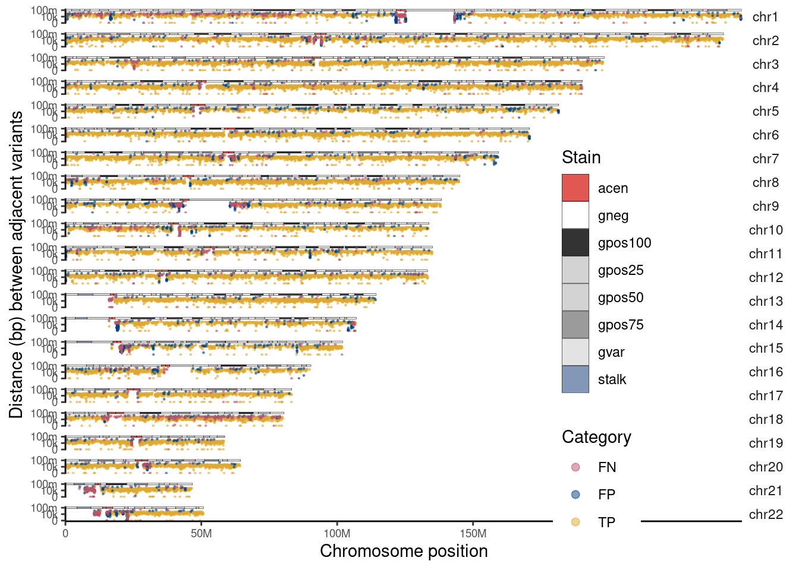

Overview of using CHM13-T2T as reference assembly
================

The use of GRCh38 is suboptimal when compared to CHM13-T2T (Nurk et al.
2022), which resolves previously unresolved repetitive, telomeric, and
centromeric regions-areas that the study itself identifies as relevant
to accuracy. We used GRCh38 reference assembly as it is the current most
common used assembly in cancer genomics study, and it offers extensive
functional and clinical annotations, integration with large-scale
resources (e.g. gnomAD, TCGA), and compatibility with the majority of
computational approaches. Meanwhile, here we evaluted the potential
improvement from using CHM13-T2T as reference for vairant calling. As
(Paulin et al. 2025) had thoroughly benchmarked the SV calling using
CHM13-T2T, I compared the alignment results when using GRCh38 and
CHM13-T2T and examed the SNV calling results from CHM13-T2T alignment
for COLO829 and HCC1937 cell lines.

The reference assembly `chm13v2.0.fa.gz` was download from the
[CHM13](https://github.com/marbl/CHM13) GitHub repo and I conducted the
same analysis including minimap2 alignment, snv calling. etc. With
CHM13-T2T as reference.

### Higher mapping rate and improved sequence divergence

| assembly | sample     | sequence_divergence | mapping_rate |
|:---------|:-----------|--------------------:|:-------------|
| T2T      | COLO829    |           0.0201259 | 99.86%       |
| GRCh38   | COLO829    |           0.0310062 | 98.31%       |
| T2T      | COLO829_BL |           0.0184784 | 99.84%       |
| GRCh38   | COLO829_BL |           0.0275728 | 98.53%       |
| T2T      | HCC1937    |           0.0165879 | 99.91%       |
| GRCh38   | HCC1937    |           0.0238883 | 99.03%       |
| T2T      | HCC1937_BL |           0.0170962 | 99.82%       |
| GRCh38   | HCC1937_BL |           0.0254134 | 98.77%       |

Improved alignment from CHM13-T2T human genome assembly

### SNV calling

I did not use our short-read gold standard to benchmark the variant
called using CHM13-T2T reference as the gold standard inherently missed
variants that are real in CHM13-T2T reference. However, I quantified
number of variants that can be found using CHM13-T2T that are

I also downloaded annotation bed files from
[CHM13](https://github.com/marbl/CHM13), including:

- telomere region
- regions non-syntenic (unique) compared to GRCh38

<!-- -->

                              prefix    recall precision        F1
    1      clairS/COLO829.COLO829_BL 0.9572448 0.9403145 0.9487041
    2 deepsomatic/COLO829.COLO829_BL 0.9517707 0.9521412 0.9519559
    3      clairS/HCC1937.HCC1937_BL 0.8633085 0.7880336 0.8239554
    4 deepsomatic/HCC1937.HCC1937_BL 0.9094527 0.7893771 0.8451714

Nurk, Sergey, Sergey Koren, Arang Rhie, Mikko Rautiainen, Andrey V.
Bzikadze, Alla Mikheenko, Mitchell R. Vollger, et al. 2022. “The
Complete Sequence of a Human Genome.” *Science* 376 (6588): 44–53.
<https://doi.org/10.1126/science.abj6987>.

Paulin, Luis F, Jeremy Fan, Kieran O’Neill, Erin Pleasance, Vanessa L
Porter, Steven J M Jones, and Fritz J Sedlazeck. 2025. “Closing the
Gaps, and Improving Somatic Structural Variant Analysis and Benchmarking
Using CHM13-T2T.” *Genome Res.* 35 (4): 621–31.

